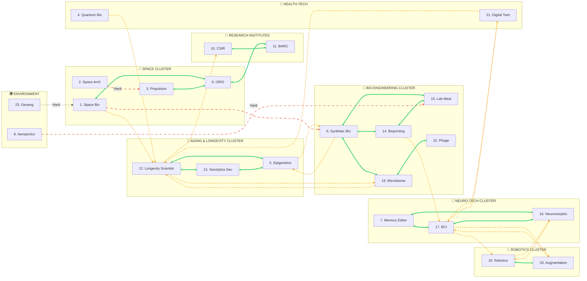
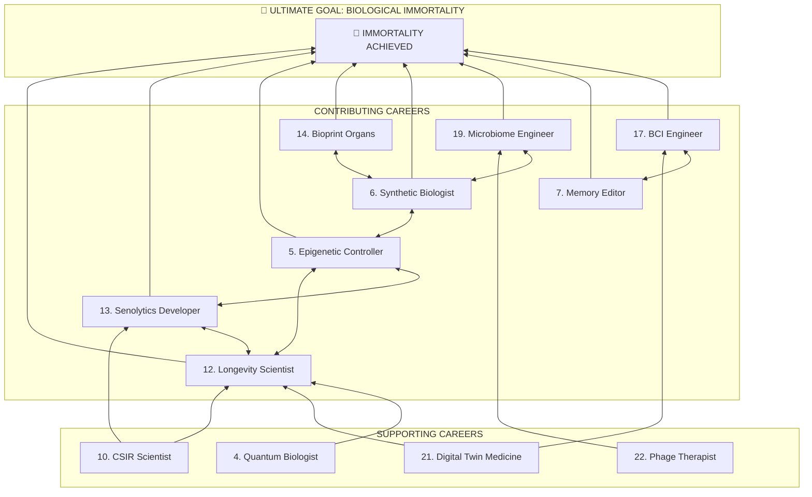
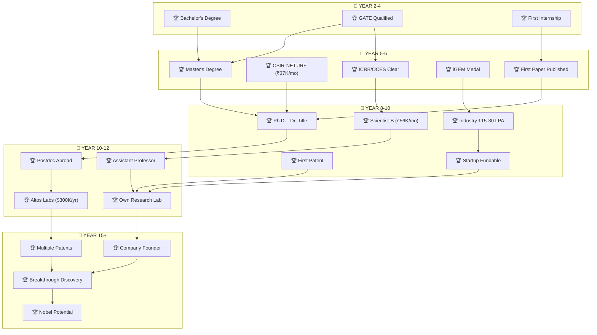
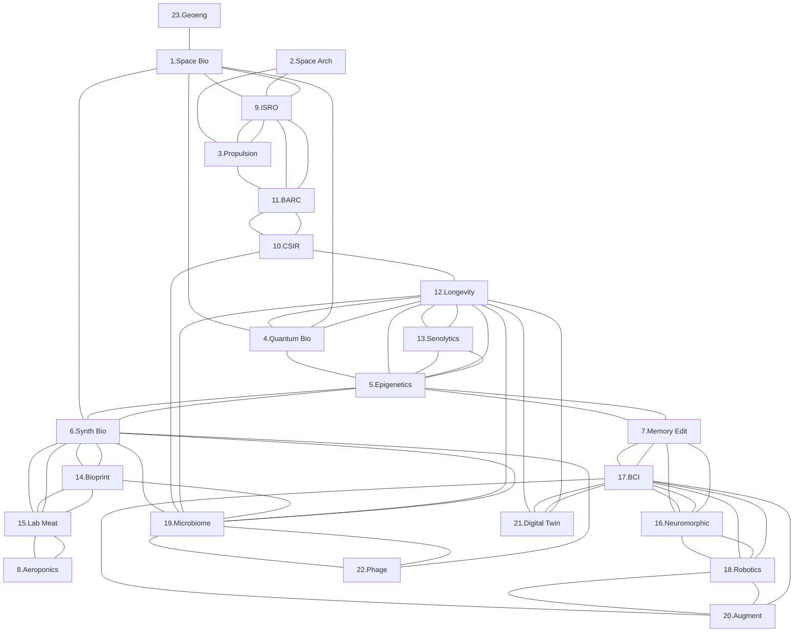

# 🌳 MEGA INTERCONNECTED CAREER MAP (Mermaid Edition)
> All 23 Fields | All Shifts | All Connections | One Massive Diagram

---

## 🎯 MASTER CAREER FLOWCHART (All Fields + All Shifts)

```mermaid
flowchart TB
    subgraph START["🎓 START POINT"]
        CLASS11["Class 11-12"]
    end

    subgraph STREAM["📚 STREAM CHOICE"]
        PCB["🧬 PCB Stream"]
        PCM["⚙️ PCM Stream"]
        PCMB["🔬 PCM+Bio Hybrid"]
    end

    CLASS11 --> PCB
    CLASS11 --> PCM
    CLASS11 --> PCMB

    subgraph UG["🎓 UNDERGRADUATE (3-5 years)"]
        BSC_BIO["B.Sc Biology/Biotech"]
        BSC_CHEM["B.Sc Chemistry"]
        BSC_PHY["B.Sc Physics"]
        BSC_MICRO["B.Sc Microbiology"]
        BSC_AGRI["B.Sc Agriculture"]
        BTECH_BIO["B.Tech Biotech/Bioengg"]
        BTECH_BME["B.Tech Biomedical"]
        BTECH_CS["B.Tech CS/IT"]
        BTECH_ECE["B.Tech ECE/EE"]
        BTECH_MECH["B.Tech Mechanical"]
        BTECH_AERO["B.Tech Aerospace"]
        BTECH_ENV["B.Tech Environmental"]
        BTECH_FOOD["B.Tech Food Tech"]
        BPHARM["B.Pharm Pharmacy"]
        BARCH["B.Arch Architecture"]
        IIST["IIST Thiruvananthapuram"]
        MBBS["MBBS Medicine"]
    end

    PCB --> BSC_BIO
    PCB --> BSC_MICRO
    PCB --> BSC_AGRI
    PCB --> BTECH_BIO
    PCB --> BTECH_BME
    PCB --> BPHARM
    PCB --> MBBS
    PCB --> BTECH_FOOD

    PCM --> BSC_PHY
    PCM --> BSC_CHEM
    PCM --> BTECH_CS
    PCM --> BTECH_ECE
    PCM --> BTECH_MECH
    PCM --> BTECH_AERO
    PCM --> BTECH_ENV
    PCM --> BARCH
    PCM --> IIST

    PCMB --> BSC_BIO
    PCMB --> BSC_PHY
    PCMB --> BTECH_BME
    PCMB --> BTECH_BIO

    subgraph PG["🎓 POSTGRADUATE (2-3 years)"]
        MSC_BIOCHEM["M.Sc Biochemistry"]
        MSC_MOLBIO["M.Sc Molecular Biology"]
        MSC_GENETICS["M.Sc Genetics"]
        MSC_MICRO["M.Sc Microbiology"]
        MSC_NEURO["M.Sc Neuroscience"]
        MSC_BIOPHYS["M.Sc Biophysics"]
        MSC_ASTRO["M.Sc Astrophysics"]
        MTECH_BIOTECH["M.Tech Biotechnology"]
        MTECH_BME["M.Tech Biomedical"]
        MTECH_TISSUE["M.Tech Tissue Engg"]
        MTECH_NEURAL["M.Tech Neural Engg"]
        MTECH_CS_AI["M.Tech CS/AI/ML"]
        MTECH_ROBOTICS["M.Tech Robotics"]
        MTECH_VLSI["M.Tech VLSI/Nano"]
        MTECH_AERO["M.Tech Aerospace"]
        MTECH_ENV["M.Tech Climate Sci"]
        MTECH_FOOD["M.Tech Food Science"]
        MTECH_HEALTH["M.Tech Health Informatics"]
        MPHARM["M.Pharm Pharmacology"]
        MS_SPACE_ARCH["M.S. Space Architecture"]
        MD_NEURO["MD/DM Neurology"]
    end

    BSC_BIO --> MSC_BIOCHEM
    BSC_BIO --> MSC_MOLBIO
    BSC_BIO --> MSC_GENETICS
    BSC_BIO --> MSC_NEURO
    BSC_MICRO --> MSC_MICRO
    BSC_PHY --> MSC_BIOPHYS
    BSC_PHY --> MSC_ASTRO
    BSC_AGRI --> MTECH_FOOD

    BTECH_BIO --> MTECH_BIOTECH
    BTECH_BIO --> MTECH_TISSUE
    BTECH_BME --> MTECH_BME
    BTECH_BME --> MTECH_NEURAL
    BTECH_BME --> MTECH_TISSUE
    BTECH_CS --> MTECH_CS_AI
    BTECH_CS --> MTECH_ROBOTICS
    BTECH_CS --> MTECH_HEALTH
    BTECH_ECE --> MTECH_VLSI
    BTECH_ECE --> MTECH_NEURAL
    BTECH_ECE --> MTECH_ROBOTICS
    BTECH_MECH --> MTECH_ROBOTICS
    BTECH_MECH --> MTECH_AERO
    BTECH_AERO --> MTECH_AERO
    BTECH_ENV --> MTECH_ENV
    BTECH_FOOD --> MTECH_FOOD
    BPHARM --> MPHARM
    BARCH --> MS_SPACE_ARCH
    MBBS --> MD_NEURO

    subgraph PHD["🎓 Ph.D. / RESEARCH (4-5 years)"]
        PHD_AGING["Ph.D. Aging/Biogerontology"]
        PHD_EPIGEN["Ph.D. Epigenetics"]
        PHD_SYNBIO["Ph.D. Synthetic Biology"]
        PHD_NEURO["Ph.D. Neuroscience"]
        PHD_COMPNEURO["Ph.D. Computational Neuro"]
        PHD_NEUROMORPH["Ph.D. Neuromorphic"]
        PHD_REGEN["Ph.D. Regenerative Med"]
        PHD_MICROBIOME["Ph.D. Microbiome"]
        PHD_PHAGE["Ph.D. Phage Biology"]
        PHD_ASTROBIO["Ph.D. Astrobiology"]
        PHD_QUANTUM["Ph.D. Quantum Biology"]
        PHD_CLIMATE["Ph.D. Climate Science"]
        PHD_ROBOTICS["Ph.D. Robotics/AI"]
        PHD_DRUG["Ph.D. Drug Discovery"]
    end

    MSC_BIOCHEM --> PHD_AGING
    MSC_BIOCHEM --> PHD_EPIGEN
    MSC_MOLBIO --> PHD_AGING
    MSC_MOLBIO --> PHD_EPIGEN
    MSC_MOLBIO --> PHD_SYNBIO
    MSC_GENETICS --> PHD_EPIGEN
    MSC_GENETICS --> PHD_SYNBIO
    MSC_MICRO --> PHD_MICROBIOME
    MSC_MICRO --> PHD_PHAGE
    MSC_NEURO --> PHD_NEURO
    MSC_NEURO --> PHD_COMPNEURO
    MSC_BIOPHYS --> PHD_QUANTUM
    MSC_ASTRO --> PHD_ASTROBIO
    MTECH_BIOTECH --> PHD_SYNBIO
    MTECH_BIOTECH --> PHD_AGING
    MTECH_TISSUE --> PHD_REGEN
    MTECH_NEURAL --> PHD_COMPNEURO
    MTECH_NEURAL --> PHD_NEUROMORPH
    MTECH_VLSI --> PHD_NEUROMORPH
    MTECH_CS_AI --> PHD_ROBOTICS
    MTECH_CS_AI --> PHD_COMPNEURO
    MTECH_ROBOTICS --> PHD_ROBOTICS
    MTECH_ENV --> PHD_CLIMATE
    MPHARM --> PHD_DRUG
    MPHARM --> PHD_AGING

    subgraph CAREERS["🚀 FINAL CAREERS (23 Fields)"]
        C1["1. Space Biologist 🌌"]
        C2["2. Space Architect 🏛️"]
        C3["3. Propulsion Engineer 🚀"]
        C4["4. Quantum Biologist ⚛️"]
        C5["5. Epigenetic Controller 🧬"]
        C6["6. Synthetic Biologist 🧪"]
        C7["7. Memory Editor 🧠"]
        C8["8. Aeroponics Specialist 🌱"]
        C9["9. ISRO Scientist 🛰️"]
        C10["10. CSIR Scientist 🔬"]
        C11["11. BARC Scientist ⚛️"]
        C12["12. Longevity Scientist ⏳"]
        C13["13. Senolytics Drug Dev 💊"]
        C14["14. Bioprint Organ Designer 🫀"]
        C15["15. Lab-Grown Meat 🥩"]
        C16["16. Neuromorphic Engineer 🧠"]
        C17["17. BCI Engineer 🔌"]
        C18["18. Robotics Agent Dev 🤖"]
        C19["19. Microbiome Engineer 🦠"]
        C20["20. Human Augmentation 🦾"]
        C21["21. Digital Twin Medicine 👤"]
        C22["22. Phage Therapist 💉"]
        C23["23. Climate Geoeng 🌍"]
    end

    PHD_ASTROBIO --> C1
    MS_SPACE_ARCH --> C2
    MTECH_AERO --> C3
    IIST --> C3
    IIST --> C9
    PHD_QUANTUM --> C4
    PHD_EPIGEN --> C5
    PHD_SYNBIO --> C6
    PHD_NEURO --> C7
    PHD_COMPNEURO --> C7
    BSC_AGRI --> C8
    MTECH_AERO --> C9
    PHD_AGING --> C10
    PHD_SYNBIO --> C10
    MTECH_AERO --> C11
    PHD_AGING --> C12
    PHD_EPIGEN --> C12
    PHD_DRUG --> C13
    PHD_AGING --> C13
    PHD_REGEN --> C14
    MTECH_TISSUE --> C14
    MTECH_FOOD --> C15
    PHD_NEUROMORPH --> C16
    MTECH_VLSI --> C16
    PHD_COMPNEURO --> C17
    MTECH_NEURAL --> C17
    PHD_ROBOTICS --> C18
    MTECH_ROBOTICS --> C18
    PHD_MICROBIOME --> C19
    MTECH_BME --> C20
    MTECH_ROBOTICS --> C20
    MTECH_HEALTH --> C21
    PHD_PHAGE --> C22
    PHD_CLIMATE --> C23

    %% INTER-CAREER SHIFTS (Can work in both or switch)
    C12 <-.-> C13
    C12 <-.-> C5
    C5 <-.-> C6
    C5 <-.-> C13
    C6 <-.-> C14
    C6 <-.-> C15
    C6 <-.-> C19
    C14 <-.-> C15
    C14 <-.-> C19
    C7 <-.-> C17
    C7 <-.-> C16
    C16 <-.-> C17
    C16 <-.-> C18
    C17 <-.-> C18
    C17 <-.-> C20
    C18 <-.-> C20
    C1 <-.-> C9
    C3 <-.-> C9
    C9 <-.-> C11
    C10 <-.-> C12
    C10 <-.-> C19
    C19 <-.-> C22
    C21 <-.-> C17
    C21 <-.-> C12

    classDef startNode fill:#ff6b6b,stroke:#333,stroke-width:3px,color:#fff
    classDef streamNode fill:#4ecdc4,stroke:#333,stroke-width:2px
    classDef ugNode fill:#45b7d1,stroke:#333,stroke-width:1px
    classDef pgNode fill:#96ceb4,stroke:#333,stroke-width:1px
    classDef phdNode fill:#ffeaa7,stroke:#333,stroke-width:1px
    classDef careerNode fill:#dfe6e9,stroke:#333,stroke-width:2px,color:#2d3436

    class CLASS11 startNode
    class PCB,PCM,PCMB streamNode
    class BSC_BIO,BSC_CHEM,BSC_PHY,BSC_MICRO,BSC_AGRI,BTECH_BIO,BTECH_BME,BTECH_CS,BTECH_ECE,BTECH_MECH,BTECH_AERO,BTECH_ENV,BTECH_FOOD,BPHARM,BARCH,IIST,MBBS ugNode
    class MSC_BIOCHEM,MSC_MOLBIO,MSC_GENETICS,MSC_MICRO,MSC_NEURO,MSC_BIOPHYS,MSC_ASTRO,MTECH_BIOTECH,MTECH_BME,MTECH_TISSUE,MTECH_NEURAL,MTECH_CS_AI,MTECH_ROBOTICS,MTECH_VLSI,MTECH_AERO,MTECH_ENV,MTECH_FOOD,MTECH_HEALTH,MPHARM,MS_SPACE_ARCH,MD_NEURO pgNode
    class PHD_AGING,PHD_EPIGEN,PHD_SYNBIO,PHD_NEURO,PHD_COMPNEURO,PHD_NEUROMORPH,PHD_REGEN,PHD_MICROBIOME,PHD_PHAGE,PHD_ASTROBIO,PHD_QUANTUM,PHD_CLIMATE,PHD_ROBOTICS,PHD_DRUG phdNode
    class C1,C2,C3,C4,C5,C6,C7,C8,C9,C10,C11,C12,C13,C14,C15,C16,C17,C18,C19,C20,C21,C22,C23 careerNode
```

---

## 🔄 CAREER SHIFT NETWORK (Who Can Shift To Whom)

---

## ⏱️ TIMELINE FLOW (Years to Each Career)

```mermaid
flowchart TD
    subgraph Y0["YEAR 0"]
        START0["🎓 Class 11-12 | PCB/PCM"]
    end

    subgraph Y3_4["YEAR 3-4"]
        UG["🎓 Bachelor's Complete"]
        QUICK1["✅ 8. Aeroponics (4 yr)"]
    end

    subgraph Y5_6["YEAR 5-6"]
        PG["🎓 Master's Complete"]
        QUICK2["✅ 11. BARC (5-6 yr)"]
        QUICK3["✅ 9. ISRO via IIST (6 yr)"]
        QUICK4["✅ 3. Propulsion (6-7 yr)"]
    end

    subgraph Y6_8["YEAR 6-8"]
        IND1["✅ 15. Lab Meat (6-7 yr)"]
        IND2["✅ 18. Robotics (6-8 yr)"]
        IND3["✅ 21. Digital Twin (6-8 yr)"]
    end

    subgraph Y8_10["YEAR 8-10"]
        PHD["🎓 Ph.D. Complete"]
        MID1["✅ 10. CSIR (8-10 yr)"]
        MID2["✅ 17. BCI (8-10 yr)"]
        MID3["✅ 16. Neuromorphic (8-10 yr)"]
        MID4["✅ 6. Synthetic Bio (8-10 yr)"]
        MID5["✅ 19. Microbiome (8-10 yr)"]
        MID6["✅ 22. Phage (8-10 yr)"]
        MID7["✅ 23. Geoeng (8-10 yr)"]
        MID8["✅ 20. Augment (8-10 yr)"]
    end

    subgraph Y10_12["YEAR 10-12"]
        POSTDOC["🎓 Postdoc Complete"]
        ADV1["✅ 12. Longevity (10-12 yr)"]
        ADV2["✅ 13. Senolytics (10-12 yr)"]
        ADV3["✅ 5. Epigenetics (10-12 yr)"]
        ADV4["✅ 14. Bioprint (10-12 yr)"]
        ADV5["✅ 1. Space Bio (10-12 yr)"]
        ADV6["✅ 2. Space Arch (10-12 yr)"]
        ADV7["✅ 4. Quantum Bio (10-12 yr)"]
    end

    subgraph Y12_15["YEAR 12-15"]
        EXPERT["🏆 Expert Level"]
        HARD1["✅ 7. Memory Editor (12-15 yr)"]
    end

    START0 --> UG
    UG --> QUICK1

    UG --> PG
    PG --> QUICK2
    PG --> QUICK3
    PG --> QUICK4

    PG --> IND1
    PG --> IND2
    PG --> IND3

    PG --> PHD
    PHD --> MID1
    PHD --> MID2
    PHD --> MID3
    PHD --> MID4
    PHD --> MID5
    PHD --> MID6
    PHD --> MID7
    PHD --> MID8

    PHD --> POSTDOC
    POSTDOC --> ADV1
    POSTDOC --> ADV2
    POSTDOC --> ADV3
    POSTDOC --> ADV4
    POSTDOC --> ADV5
    POSTDOC --> ADV6
    POSTDOC --> ADV7

    POSTDOC --> EXPERT
    EXPERT --> HARD1
```

---

## 🧬 FOUNDATION SKILLS → CAREER MAPPING

```mermaid
flowchart TB
    subgraph SKILLS["🔧 CORE SKILLS"]
        PYTHON["🐍 Python"]
        MOLBIO["🧬 Molecular Biology"]
        CELLCULT["🧫 Cell Culture"]
        ML["🤖 Machine Learning"]
        SIGNAL["📊 Signal Processing"]
        CRISPR["✂️ CRISPR/Gene Editing"]
        ROS["🤖 ROS (Robotics)"]
        BIOINF["💻 Bioinformatics"]
        NEUROSC["🧠 Neuroscience"]
        VLSI["⚡ VLSI Design"]
        FOOD["🍽️ Food Science"]
        AERO["🚀 Aerospace"]
    end

    subgraph CAREERS_ALL["🚀 ALL 23 CAREERS"]
        C1["1. Space Bio"]
        C2["2. Space Arch"]
        C3["3. Propulsion"]
        C4["4. Quantum Bio"]
        C5["5. Epigenetics"]
        C6["6. Synth Bio"]
        C7["7. Memory Edit"]
        C8["8. Aeroponics"]
        C9["9. ISRO"]
        C10["10. CSIR"]
        C11["11. BARC"]
        C12["12. Longevity"]
        C13["13. Senolytics"]
        C14["14. Bioprint"]
        C15["15. Lab Meat"]
        C16["16. Neuromorphic"]
        C17["17. BCI"]
        C18["18. Robotics"]
        C19["19. Microbiome"]
        C20["20. Augment"]
        C21["21. Digital Twin"]
        C22["22. Phage"]
        C23["23. Geoeng"]
    end

    %% Python connects to many
    PYTHON --> C1
    PYTHON --> C4
    PYTHON --> C5
    PYTHON --> C6
    PYTHON --> C7
    PYTHON --> C10
    PYTHON --> C12
    PYTHON --> C13
    PYTHON --> C14
    PYTHON --> C16
    PYTHON --> C17
    PYTHON --> C18
    PYTHON --> C19
    PYTHON --> C21
    PYTHON --> C22

    %% Molecular Biology
    MOLBIO --> C1
    MOLBIO --> C4
    MOLBIO --> C5
    MOLBIO --> C6
    MOLBIO --> C7
    MOLBIO --> C10
    MOLBIO --> C12
    MOLBIO --> C13
    MOLBIO --> C14
    MOLBIO --> C15
    MOLBIO --> C19
    MOLBIO --> C22

    %% Cell Culture
    CELLCULT --> C5
    CELLCULT --> C6
    CELLCULT --> C12
    CELLCULT --> C13
    CELLCULT --> C14
    CELLCULT --> C15
    CELLCULT --> C19

    %% ML
    ML --> C7
    ML --> C16
    ML --> C17
    ML --> C18
    ML --> C21

    %% CRISPR
    CRISPR --> C5
    CRISPR --> C6
    CRISPR --> C7
    CRISPR --> C12

    %% ROS
    ROS --> C18
    ROS --> C20

    %% Signal Processing
    SIGNAL --> C7
    SIGNAL --> C16
    SIGNAL --> C17

    %% Neuroscience
    NEUROSC --> C7
    NEUROSC --> C16
    NEUROSC --> C17

    %% VLSI
    VLSI --> C16

    %% Aerospace
    AERO --> C2
    AERO --> C3
    AERO --> C9
    AERO --> C11

    %% Food
    FOOD --> C8
    FOOD --> C15

    %% Bioinformatics
    BIOINF --> C1
    BIOINF --> C5
    BIOINF --> C6
    BIOINF --> C10
    BIOINF --> C12
    BIOINF --> C19
```

---

## 🔀 DUAL-CAREER POSSIBILITIES (Do Both Simultaneously)

---

## 🎯 ULTIMATE GOAL CONVERGENCE

---

## 🏆 ACHIEVEMENT PROGRESSION TREE

---

---

> **Legend:**
> - **Solid lines** = Easy shift (same foundation)
> - **Dashed lines** = Medium shift (some reskilling)
> - **Double arrows** = Can do both simultaneously
> - **Clusters** = Related career groups
