# FILE 1: THE TREE-BRANCH EXECUTION MAP
## Project Prometheus — Quantum Bioinformatics Operational Roadmap
### Swastik | Start: Feb 2026 | Target Application: VQE + QML for Genetic Engineering

---

## LEGEND

```
[MATH]  = Mathematics node
[PHYS]  = Physics node
[CODE]  = Python/NumPy/Qiskit coding node
[QC]    = Quantum Computing theory node
[APP]   = Application node (VQE, QML, Bio)

★ ML OVERLAP  = This math is shared with your ML track — study ONCE
🧬 BIO LINK   = Direct connection to genetic/molecular biology
⚡ PARALLEL   = Can be studied simultaneously with another track
⛔ BLOCKER    = Must complete before proceeding — hard dependency
```

---

## PHASE STRUCTURE OVERVIEW

```
PHASE 0  →  PHASE 1  →  PHASE 2  →  PHASE 3  →  PHASE 4  →  PHASE 5
(Weeks    (Weeks      (Weeks      (Weeks      (Weeks      (Months
 1-2)      3-10)       11-18)      19-26)      27-36)      10-24)

Bridge    Math &      Quantum     QC Theory   Quantum     Bio
Setup     Physics     Foundations & Qiskit    Algorithms  Applications
          Foundations
```

---

## FULL MERMAID DEPENDENCY TREE

```mermaid
flowchart TD

%% ═══════════════════════════════════════════════
%% PHASE 0: BRIDGE (Weeks 1-2)
%% ═══════════════════════════════════════════════

P0A["[CODE] P0.1\nNumPy & Python Math Tools\n(Arrays, linalg, complex module)\n★ ML OVERLAP"]
P0B["[MATH] P0.2\nNumber Systems Review\n(Real, Imaginary, Complex intro)\n10th ICSE → Complex bridge"]

P0A --> P1A
P0B --> M1A

%% ═══════════════════════════════════════════════
%% PHASE 1: MATH FOUNDATIONS (Weeks 3-10)
%% ═══════════════════════════════════════════════

%% -- TRACK 1: MATHEMATICS --

M1A["[MATH] M1.1\nComplex Numbers\n(Arithmetic, Polar form,\nEuler's formula e^iθ)"]
M1B["[MATH] M1.2\nFunctions & Limits\n(Intro to Calculus intuition)\n★ ML OVERLAP"]
M1C["[MATH] M1.3\nDerivatives & Basic Integration\n(Rules, chain rule, partial derivatives)\n★ ML OVERLAP"]

M1A --> M2A
M1B --> M1C
M1C --> M2A

M2A["[MATH] M2.1\nVectors & Vector Spaces\n(Operations, linear combo,\nbasis, span, dimension)\n★ ML OVERLAP"]
M2B["[MATH] M2.2\nMatrices & Matrix Operations\n(Multiply, transpose, inverse,\nconjugate transpose †)\n★ ML OVERLAP"]
M2C["[MATH] M2.3\nSpecial Matrices\n(Identity, Pauli X/Y/Z,\nHermitian, Unitary)\n⛔ BLOCKER for QC"]

M2A --> M2B
M2B --> M2C
M2C --> M3A

M3A["[MATH] M3.1\nEigenvalues & Eigenvectors\n(Characteristic eq, diagonalization,\nspectral theorem)\n★ ML OVERLAP (PCA)\n🧬 BIO LINK (Energy levels)"]
M3B["[MATH] M3.2\nInner Products & Orthogonality\n(Dot product in ℂⁿ, orthonormality,\nGram-Schmidt)\n⛔ BLOCKER for Dirac notation"]
M3C["[MATH] M3.3\nTensor Products (⊗)\n(Kronecker product, multi-system\nstate space construction)"]

M3A --> M3B
M3B --> M3C
M3C --> M4A

M4A["[MATH] M4.1\nHilbert Spaces\n(Abstract vector space, completeness,\nbasis expansion, function spaces)"]
M4B["[MATH] M4.2\nProbability & Statistics\n(Distributions, expectation value,\nBayesian reasoning)\n★ ML OVERLAP"]
M4C["[MATH] M4.3\nBasic Differential Equations\n(1st order ODE, separation of variables)\n→ Needed for Schrödinger Eq."]

M4A --> QC1A
M4B --> QC1A
M4C --> Ph2A

%% -- TRACK 2: PHYSICS (Parallel to Math Track) --

P1A["[PHYS] Ph1.1\nClassical Mechanics Basics\n(Work, Energy, Kinetic/Potential)\n⚡ PARALLEL with M1"]
Ph1B["[PHYS] Ph1.2\nHamiltonian Mechanics\n(H = T + V, equations of motion,\nenergy as generator)\n🧬 BIO LINK (Molecular energy)"]
Ph1C["[PHYS] Ph1.3\nWave Mechanics\n(Wave equation, amplitude,\nfrequency, phase, superposition)\n⚡ PARALLEL with M2"]

P1A --> Ph1B
Ph1B --> Ph1C
Ph1C --> Ph2A

Ph2A["[PHYS] Ph2.1\nSchrödinger Equation\n(Time-dependent & time-independent,\nwavefunction ψ, probability |ψ|²)\n⛔ BLOCKER — needs M4.3\n🧬 BIO LINK (Electron orbitals)"]
Ph2B["[PHYS] Ph2.2\nQuantum Postulates\n(State, observable, measurement,\ncollapse, Born rule)\n⛔ BLOCKER for QC"]
Ph2C["[PHYS] Ph2.3\nDirac Notation\n(Bra ⟨φ|, Ket |ψ⟩, operators,\ncommutators [A,B])\n⛔ BLOCKER for all QC work"]

Ph2A --> Ph2B
Ph2B --> Ph2C
Ph2C --> QC1A

%% -- CODE TRACK (Continuous from Phase 0) --

C1A["[CODE] C1.1\nNumPy Linear Algebra\n(np.linalg.eig, matrix ops,\ncomplex arrays, dot products)"]
C1B["[CODE] C1.2\nVisualization Tools\n(Matplotlib, plot wavefunctions,\neigenvalue distributions)\n★ ML OVERLAP"]

M2C --> C1A
C1A --> C1B
C1B --> C2A

%% ═══════════════════════════════════════════════
%% PHASE 2: QUANTUM FOUNDATIONS (Weeks 11-18)
%% ═══════════════════════════════════════════════

QC1A["[QC] QC1.1\nQubits & Quantum States\n(|0⟩, |1⟩, superposition,\nBloch sphere, state vector)"]
QC1B["[QC] QC1.2\nQuantum Gates\n(X, Y, Z, H, S, T, CNOT, Toffoli)\n(Unitary, reversible, gate matrices)"]
QC1C["[QC] QC1.3\nQuantum Measurement\n(Born rule, projection,\ncollapse, basis measurement)"]
QC1D["[QC] QC1.4\nEntanglement & Bell States\n(EPR pairs, non-separability,\nschmidt decomposition)\n🧬 BIO LINK (Electron correlation)"]

QC1A --> QC1B
QC1B --> QC1C
QC1C --> QC1D
QC1D --> QC2A

C2A["[CODE] C2.1\nQiskit Basics\n(QuantumCircuit, gates,\nmeasure, transpile)"]
C2B["[CODE] C2.2\nQiskit Simulators\n(Statevector sim, Aer, QASM,\nnoise models, density matrix)"]
C2C["[CODE] C2.3\nParameterized Circuits\n(ParameterVector, bind_parameters,\ncircuit composition)"]

QC1B --> C2A
C2A --> C2B
C2B --> C2C
C2C --> QC2A

%% ═══════════════════════════════════════════════
%% PHASE 3: QC THEORY & ALGORITHMS (Weeks 19-26)
%% ═══════════════════════════════════════════════

QC2A["[QC] QC2.1\nQuantum Circuit Complexity\n(Circuit depth, gate count,\ntwo-qubit gate bottleneck)"]
QC2B["[QC] QC2.2\nVariational Principle\n(Rayleigh-Ritz, expectation value ⟨H⟩,\nwhy minimum eigenvalue = ground state)\n⛔ BLOCKER for VQE\n🧬 BIO LINK (Molecular ground state)"]
QC2C["[QC] QC2.3\nAnsatz Circuit Design\n(Hardware-efficient, chemically inspired,\nUCCSD ansatz, expressibility)\n🧬 BIO LINK (Trial wavefunctions)"]
QC2D["[QC] QC2.4\nClassical Optimizers\n(COBYLA, SPSA, Adam, landscape,\nbarren plateau problem)\n★ ML OVERLAP (Gradient Descent)"]

QC2A --> QC2B
QC2B --> QC2C
QC2C --> QC2D
QC2D --> APP1A

QC3A["[QC] QC3.1\nGrover's Algorithm\n(Oracle construction, amplitude\namplification, O(√N) speedup)\n🧬 BIO LINK (Sequence database search)"]
QC3B["[QC] QC3.2\nQuantum Phase Estimation\n(QPE circuit, precision,\napplication to eigenvalue finding)"]

QC2B --> QC3A
QC2A --> QC3B
QC3B --> APP1A

%% ═══════════════════════════════════════════════
%% PHASE 4: VQE & MOLECULAR SIM (Weeks 27-36)
%% ═══════════════════════════════════════════════

APP1A["[APP] A1.1\nMolecular Hamiltonian Construction\n(Second quantization, fermionic operators,\nbasis sets STO-3G, 6-31G)\n🧬 BIO LINK (Electronic structure)"]
APP1B["[APP] A1.2\nFermionic-to-Qubit Mapping\n(Jordan-Wigner transform,\nBravyi-Kitaev) \n🧬 BIO LINK (DNA → qubit encoding)"]
APP1C["[APP] A1.3\nVQE Full Implementation\n(H₂ ground state from scratch,\nEstimator, SparsePauliOp)\n⛔ MASTER CHECKPOINT"]
APP1D["[APP] A1.4\nQiskit Nature\n(PySCF driver, ElectronicStructureProblem,\nOrbital transformations)\n🧬 BIO LINK (Protein fragment sim)"]

APP1A --> APP1B
APP1B --> APP1C
APP1C --> APP1D
APP1D --> APP2A

C3A["[CODE] C3.1\nQiskit Nature Pipeline\n(Install, PySCF integration,\nrun H₂, LiH, H₂O simulations)\n🧬 BIO LINK (Small bio-molecule sim)"]
C3B["[CODE] C3.2\nBond Dissociation Curves\n(Energy vs bond length,\nconfirm against NIST data)\n🧬 BIO LINK (Chemical bond behavior)"]

APP1C --> C3A
C3A --> C3B
C3B --> APP2A

%% ═══════════════════════════════════════════════
%% PHASE 5: QML & BIO APPLICATIONS (Months 10-24)
%% ═══════════════════════════════════════════════

APP2A["[APP] A2.1\nQuantum Machine Learning Foundations\n(Quantum kernels, QSVM,\nfeature maps, data encoding)\n★ ML OVERLAP (SVM, kernels)"]
APP2B["[APP] A2.2\nQuantum Neural Networks (QNN)\n(PQC as QNN, loss function,\nhybrid backprop, Pennylane)\n★ ML OVERLAP (Neural Networks)"]
APP2C["[APP] A2.3\nQuantum-Classical Hybrid Pipeline\n(PyTorch + Pennylane/Qiskit,\nend-to-end trainable circuit)\n★ ML OVERLAP (Deep Learning)"]

APP2A --> APP2B
APP2B --> APP2C
APP2C --> APP3A

APP3A["[APP] A3.1\nGrover's on Genomic Databases\n(Implement oracle for DNA sequence,\nquadratic speedup on BLAST-style search)\n🧬 BIO LINK (DNA search)"]
APP3B["[APP] A3.2\nGene Expression Prediction\n(QML pipeline on genomic data,\nGEO dataset, quantum feature map)\n🧬 BIO LINK (Gene prediction)"]
APP3C["[APP] A3.3\nMutation Impact Classification\n(QSVM on protein variant data,\nclinvar dataset)\n🧬 BIO LINK (Mutation prediction)"]
APP3D["[APP] A3.4\nMolecular Docking Prototype\n(VQE + drug-gene interaction simulation,\ncustom ansatz for biomolecule)\n🧬 BIO LINK (Drug-gene binding)"]

APP3A --> APP3B
APP3B --> APP3C
APP3C --> APP3D

%% OPEN SOURCE CONTRIBUTION GATE
OSC["[CODE] OSC\nOpen Source Contribution\n(Fix Qiskit/PennyLane bug or tutorial,\nPR merged = proof of mastery)"]
APP3D --> OSC

%% ═══════════════════════════════════════════════
%% STYLE DEFINITIONS
%% ═══════════════════════════════════════════════

style P0A fill:#2d4a22,color:#fff
style P0B fill:#2d4a22,color:#fff
style M1A fill:#1a3a5c,color:#fff
style M1B fill:#1a3a5c,color:#fff
style M1C fill:#1a3a5c,color:#fff
style M2A fill:#1a3a5c,color:#fff
style M2B fill:#1a3a5c,color:#fff
style M2C fill:#1a3a5c,color:#fff
style M3A fill:#1a3a5c,color:#fff
style M3B fill:#1a3a5c,color:#fff
style M3C fill:#1a3a5c,color:#fff
style M4A fill:#1a3a5c,color:#fff
style M4B fill:#1a3a5c,color:#fff
style M4C fill:#1a3a5c,color:#fff
style P1A fill:#3d1f5c,color:#fff
style Ph1B fill:#3d1f5c,color:#fff
style Ph1C fill:#3d1f5c,color:#fff
style Ph2A fill:#3d1f5c,color:#fff
style Ph2B fill:#3d1f5c,color:#fff
style Ph2C fill:#3d1f5c,color:#fff
style C1A fill:#2d4a22,color:#fff
style C1B fill:#2d4a22,color:#fff
style C2A fill:#2d4a22,color:#fff
style C2B fill:#2d4a22,color:#fff
style C2C fill:#2d4a22,color:#fff
style C3A fill:#2d4a22,color:#fff
style C3B fill:#2d4a22,color:#fff
style QC1A fill:#5c3d00,color:#fff
style QC1B fill:#5c3d00,color:#fff
style QC1C fill:#5c3d00,color:#fff
style QC1D fill:#5c3d00,color:#fff
style QC2A fill:#5c3d00,color:#fff
style QC2B fill:#5c3d00,color:#fff
style QC2C fill:#5c3d00,color:#fff
style QC2D fill:#5c3d00,color:#fff
style QC3A fill:#5c3d00,color:#fff
style QC3B fill:#5c3d00,color:#fff
style APP1A fill:#5c1a1a,color:#fff
style APP1B fill:#5c1a1a,color:#fff
style APP1C fill:#8b0000,color:#fff
style APP1D fill:#5c1a1a,color:#fff
style APP2A fill:#5c1a1a,color:#fff
style APP2B fill:#5c1a1a,color:#fff
style APP2C fill:#5c1a1a,color:#fff
style APP3A fill:#5c1a1a,color:#fff
style APP3B fill:#5c1a1a,color:#fff
style APP3C fill:#5c1a1a,color:#fff
style APP3D fill:#5c1a1a,color:#fff
style OSC fill:#8b0000,color:#fff
```



---

## PHASE TIMELINE SUMMARY

| Phase | Weeks | Duration | Focus |
|-------|-------|----------|-------|
| **Phase 0** | 1-2 | 2 weeks | Bridge Setup (NumPy, Complex intro) |
| **Phase 1** | 3-10 | 8 weeks | Math + Physics Foundations |
| **Phase 2** | 11-18 | 8 weeks | Quantum Theory + Qiskit Basics |
| **Phase 3** | 19-26 | 8 weeks | QC Algorithms + VQE Theory |
| **Phase 4** | 27-36 | 10 weeks | VQE Implementation + Molecular Sim |
| **Phase 5** | 37-72+ | 9+ months | QML + Bio Applications |

**VQE Ready**: ~Week 32 (Month 8)
**Research-paper readable**: ~Week 40 (Month 10)
**Innovation-capable**: ~Month 18-24

---

## NODE COUNT

| Domain | Nodes |
|--------|-------|
| [MATH] | 12 |
| [PHYS] | 6 |
| [CODE] | 8 |
| [QC] | 8 |
| [APP] | 11 |
| **Total** | **45 nodes** |

> Next: See File 2 for the deep-dive block on every single node above.
