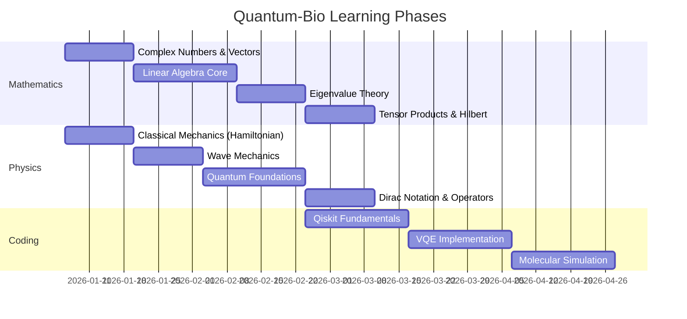

# 🧬⚛️ PROJECT PROMETHEUS: Quantum-Bio Master Blueprint

> **CLASSIFICATION**: Chief Scientific Officer Strategic Directive  
> **OPERATOR**: Class 11 → Quantum Bioinformatics Pioneer  
> **TIMELINE**: January 2026 → Class 12 Completion (Pre-requisite Foundation Phase)  
> **CONSTRAINT**: 3-4 hours/day operational capacity

---

## Executive Summary

This document constitutes the operational blueprint for achieving **Quantum Bioinformatics competency** before Class 12 completion. The objective is to establish foundational mastery in the three pillars:

```
┌─────────────────────────────────────────────────────────────────────┐
│                      QUANTUM BIOINFORMATICS                        │
├─────────────────────┬───────────────────────┬─────────────────────┤
│   MATHEMATICS       │     PHYSICS           │   COMPUTATIONAL     │
│   (Linear Algebra)  │ (Quantum Mechanics)   │   (Qiskit/VQE)      │
├─────────────────────┴───────────────────────┴─────────────────────┤
│                     BIOLOGICAL APPLICATION                         │
│        (Molecular Simulation, Gene Network Analysis)              │
└───────────────────────────────────────────────────────────────────┘
```

---

# DIMENSION 1: THE QUANTUM-BIO LEARNING ROADMAP

## Phase Architecture (16 Weeks Total)



---

## 1.1 MATHEMATICS PREREQUISITES (9 Weeks)

> **WHY THIS ORDER**: Each topic builds on the previous. You cannot understand tensor products without knowing what a vector space is. You cannot understand quantum states without eigenvalues.

### Module M1: Complex Numbers & Vectors (Weeks 1-2)
**Biological Justification**: Quantum wavefunctions (`ψ`) are complex-valued. When you simulate a molecule's electron cloud, every probability amplitude is a complex number `a + bi`.

| Topic | Depth Required | Bio Application |
|-------|---------------|-----------------|
| Complex number arithmetic | Full mastery | Probability amplitudes in molecular orbitals |
| Polar form (`re^iθ`) | Full mastery | Quantum phase in molecular bonding |
| Euler's formula | Derivation-level | Rotation operators in quantum gates |
| Vector spaces (ℂⁿ) | Definition + operations | Hilbert space foundation |
| Vector operations (add, scale) | Fluent | Superposition of quantum states |

**Resources**:
- 3Blue1Brown: "Essence of Linear Algebra" (Episodes 1-3)
- MIT OCW 18.06: Lecture 1-2

**Checkpoint**: Can you represent `|ψ⟩ = (1/√2)|0⟩ + (i/√2)|1⟩` as a column vector?

---

### Module M2: Linear Algebra Core (Weeks 3-5)
**Biological Justification**: Quantum gates are unitary matrices. The Hamiltonian of a molecule is a matrix. Matrix multiplication IS quantum evolution.

| Topic | Depth Required | Bio Application |
|-------|---------------|-----------------|
| Matrix multiplication | Fluent | Quantum gate application |
| Special matrices (Identity, Pauli) | Memorize | Pauli X/Y/Z are fundamental quantum operations |
| Matrix transpose, conjugate | Fluent | Hermitian operators (observables) |
| Determinants | Conceptual | Checking invertibility of transformations |
| Matrix inverse | Computational | Unitary gate decomposition |
| Unitary matrices (U†U = I) | Deep understanding | **ALL quantum gates are unitary** |
| Hermitian matrices (H† = H) | Deep understanding | **ALL observables are Hermitian** |

**Resources**:
- Khan Academy: Linear Algebra (selective)
- Gilbert Strang MIT 18.06 Lectures 4-10

**Checkpoint**: Can you verify that the Hadamard gate H is unitary?
```
H = (1/√2) * [[1,  1],
              [1, -1]]
```

---

### Module M3: Eigenvalue Theory (Weeks 6-7)
**Biological Justification**: The **ground state energy** of a molecule (what VQE computes) is the **minimum eigenvalue** of the molecular Hamiltonian. When you run VQE to find how a drug binds to a protein, you're solving the eigenvalue problem.

| Topic | Depth Required | Bio Application |
|-------|---------------|-----------------|
| Eigenvalue definition (Av = λv) | First-principles | Energy levels of molecular systems |
| Characteristic polynomial | Can compute | Finding eigenvalues of 2x2, 3x3 |
| Eigenvectors | Can compute + interpret | **Quantum states that are stable under measurement** |
| Diagonalization | Conceptual | Simplifying Hamiltonians |
| Spectral theorem | Statement + application | Observable measurement postulate |

> **KEY INSIGHT**: When you measure a quantum system, you always get an eigenvalue. The system collapses to the corresponding eigenvector. This is THE fundamental law connecting math to molecular reality.

**Checkpoint**: Given Pauli Z = [[1, 0], [0, -1]], find its eigenvalues and eigenvectors. What do they represent physically?

---

### Module M4: Tensor Products & Hilbert Spaces (Weeks 8-9)
**Biological Justification**: A single molecule has multiple electrons. Each electron is a quantum system. The full molecular wavefunction lives in the **tensor product** of individual electron Hilbert spaces. There is no escaping this.

| Topic | Depth Required | Bio Application |
|-------|---------------|-----------------|
| Tensor product definition | Can compute | Multi-qubit systems |
| Kronecker product (⊗) | Fluent | Building 2-qubit, 4-qubit states |
| Hilbert space | Axiomatic understanding | The "arena" where quantum states live |
| Inner product ⟨ψ|φ⟩ | Fluent | Probability amplitude, overlap integral |
| Orthonormality | Deep understanding | Measurement basis states |

**Example**: Two-qubit system
```
|00⟩ = |0⟩ ⊗ |0⟩ = [1, 0, 0, 0]ᵀ
|01⟩ = |0⟩ ⊗ |1⟩ = [0, 1, 0, 0]ᵀ
```

For a molecule with 4 electrons in 8 orbitals → 2⁸ = 256 dimensional Hilbert space!

**Checkpoint**: Compute `|0⟩ ⊗ |+⟩` where `|+⟩ = (1/√2)(|0⟩ + |1⟩)`

---

## 1.2 PHYSICS PREREQUISITES (9 Weeks, Parallel Track)

### Module P1: Classical Mechanics - Hamiltonian Formalism (Weeks 1-2)
**Biological Justification**: The molecular Hamiltonian `H = T + V` (kinetic + potential energy) is the CENTRAL object in computational chemistry. VQE exists to find eigenvalues of H.

| Topic | Depth Required | Bio Application |
|-------|---------------|-----------------|
| Energy as H = T + V | Conceptual | Molecular total energy |
| Lagrangian → Hamiltonian | Derivation awareness | Why H is the "generator of time evolution" |
| Phase space | Conceptual | Classical limit of quantum mechanics |
| Conservation laws | Conceptual | Why energy eigenstates are stable |

**Why this matters**: The Schrödinger equation is `iℏ(∂ψ/∂t) = Hψ`. The Hamiltonian H determines EVERYTHING about the molecule's behavior.

---

### Module P2: Wave Mechanics (Weeks 3-4)
**Biological Justification**: Electrons in molecules behave as waves. Chemical bonds exist because electron wavefunctions overlap constructively.

| Topic | Depth Required | Bio Application |
|-------|---------------|-----------------|
| Wave equation | Can solve simple cases | Analogous to Schrödinger Eq. |
| Superposition principle | Deep understanding | Molecular orbital theory |
| Interference | Conceptual | Bonding vs antibonding orbitals |
| Standing waves | Can visualize | Electron orbitals in atoms |

**Checkpoint**: Why does the bonding orbital have LOWER energy than antibonding? (Hint: constructive vs destructive interference of electron density)

---

### Module P3: Quantum Mechanics Foundations (Weeks 5-7)
**Biological Justification**: This IS the theory that governs molecular behavior. Without this, you cannot understand what VQE is actually computing.

| Topic | Depth Required | Bio Application |
|-------|---------------|-----------------|
| Wavefunction ψ(x) | Physical interpretation | Probability amplitude for electron position |
| Probability density |ψ|² | Fluent | Where electrons "are" in a molecule |
| Superposition | First-principles | **Why quantum computers can simulate molecules classically can't** |
| Entanglement | Conceptual + examples | Electron correlation in molecules |
| Schrödinger Equation (TISE) | Can solve for particle in box | Finding molecular energy levels |
| Measurement postulate | Deep understanding | Why chemistry experiments give definite results |

> **CRITICAL**: The reason classical computers FAIL at molecular simulation is that the wavefunction of N particles lives in 3^N dimensional space. 100 electrons → 3^100 numbers to store. Quantum computers avoid this because qubits naturally live in exponentially large spaces.

**The Mapping**:
```
Classical chemistry problem → Molecular Hamiltonian H
                           → Map H to qubit Hamiltonian (Jordan-Wigner)
                           → Use VQE to find minimum eigenvalue
                           → Ground state energy = molecular stability
```

---

### Module P4: Dirac Notation & Operators (Weeks 8-9)
**Biological Justification**: This is the LANGUAGE of quantum computing and quantum chemistry papers. You cannot read a single VQE paper without fluency in bra-ket notation.

| Topic | Depth Required | Bio Application |
|-------|---------------|-----------------|
| Ket |ψ⟩ | Native usage | Quantum state representation |
| Bra ⟨ψ| | Native usage | Dual vector (for computing overlaps) |
| Inner product ⟨φ|ψ⟩ | Fluent | Probability amplitude |
| Outer product |ψ⟩⟨φ| | Can compute | Projection operators, density matrices |
| Hermitian operators | Deep understanding | Observable quantities (energy, position) |
| Commutators [A, B] | Can compute | Uncertainty principle, simultaneous measurability |

**Checkpoint**: Compute ⟨0|H|0⟩ where H is the Hadamard gate.

---

## 1.3 CODING & TOOLS (9 Weeks)

### Module C1: Qiskit Fundamentals (Weeks 10-12)
**Prerequisites**: Complete M1-M3, P1-P3, or parallel completion

| Topic | Implementation | Bio Application |
|-------|---------------|-----------------|
| Qiskit installation | Environment setup | - |
| QuantumCircuit class | Build 1-5 qubit circuits | Quantum state preparation |
| Basic gates (X, Y, Z, H, CNOT) | Apply and verify | Quantum operations |
| Measurement | Execute and interpret | Extracting classical information |
| Visualization | Histograms, Bloch sphere | Understanding quantum states |
| Statevector simulation | Debug quantum circuits | Verify your understanding |

**First Program**: Create Bell state `|Φ+⟩ = (1/√2)(|00⟩ + |11⟩)`
```python
from qiskit import QuantumCircuit
qc = QuantumCircuit(2)
qc.h(0)      # Hadamard on qubit 0
qc.cx(0, 1)  # CNOT with control=0, target=1
```

---

### Module C2: VQE Implementation (Weeks 13-15)
**THE CORE ALGORITHM**: This is what you will use to simulate molecules.

| Topic | Implementation | Bio Application |
|-------|---------------|-----------------|
| Variational principle | Theoretical understanding | Why VQE gives upper bound to ground state |
| Ansatz circuits | EfficientSU2, hardware-efficient | Parameterized trial wavefunction |
| Estimator primitive | Computing ⟨ψ(θ)|H|ψ(θ)⟩ | Expected energy |
| Classical optimizers | COBYLA, SPSA | Parameter optimization |
| Cost function landscape | Visualization | Understanding optimization difficulty |

**VQE Workflow**:
```
1. Define molecular Hamiltonian H
2. Choose ansatz circuit U(θ)
3. Prepare trial state |ψ(θ)⟩ = U(θ)|0⟩
4. Measure E(θ) = ⟨ψ(θ)|H|ψ(θ)⟩
5. Classical optimizer adjusts θ
6. Repeat until E converges to minimum
7. Minimum E ≈ ground state energy
```

---

### Module C3: Molecular Simulation (Weeks 16-18)
**THE APPLICATION**: Actually simulating molecules

| Topic | Implementation | Bio Application |
|-------|---------------|-----------------|
| Molecular Hamiltonian construction | Using qiskit-nature | Define the chemical problem |
| Fermionic-to-qubit mapping | Jordan-Wigner transform | Make chemistry runnable on qubits |
| Basis sets (STO-3G, 6-31G) | Selection and tradeoffs | Accuracy vs computational cost |
| H₂ molecule simulation | Full implementation | Your first molecular simulation |
| Bond dissociation curves | Energy vs bond length | Chemical insight |

**Target**: Compute the ground state energy of H₂ at various bond lengths

---

# DIMENSION 2: STRATEGIC TIME MANAGEMENT

## Daily Time Budget (3-4 hours)

```
┌────────────────────────────────────────────────────────────────────┐
│                    DAILY EXECUTION PROTOCOL                        │
├────────────────────────────────────────────────────────────────────┤
│ BLOCK 1 (90 min): THEORY ACQUISITION                              │
│   → Video lectures, textbook reading                               │
│   → Active note-taking with derivations                            │
│   → Best: Morning (high cognitive capacity)                        │
├────────────────────────────────────────────────────────────────────┤
│ BLOCK 2 (60 min): PRACTICE & IMPLEMENTATION                       │
│   → Problem sets, coding exercises                                 │
│   → Qiskit implementation of concepts                              │
│   → Best: After theory while memory is fresh                       │
├────────────────────────────────────────────────────────────────────┤
│ BLOCK 3 (30-60 min): REVIEW & CONSOLIDATION                       │
│   → Feynman technique: explain to rubber duck                      │
│   → Spaced repetition (Anki cards for key formulas)               │
│   → Best: Evening before sleep (memory consolidation)              │
└────────────────────────────────────────────────────────────────────┘
```

## Weekly Module Breakdown

| Week | Mathematics (90 min/day) | Physics (60 min/day) | Coding (30 min/day) |
|------|-------------------------|---------------------|---------------------|
| 1 | Complex numbers | Hamiltonian basics | Python env setup |
| 2 | Vectors, operations | Energy formalism | NumPy refresher |
| 3 | Matrix operations | Wave equation | - |
| 4 | Special matrices | Interference | Qiskit install |
| 5 | Unitary/Hermitian | Schrödinger basics | Basic circuits |
| 6 | Eigenvalues intro | TISE solutions | Gates practice |
| 7 | Eigenvector comp. | Superposition | Measurement |
| 8 | Tensor products | Entanglement | Multi-qubit |
| 9 | Hilbert spaces | Dirac notation | Visualization |
| 10-12 | Review + gaps | Review + gaps | Qiskit deep dive |
| 13-15 | Applied problems | Applied problems | VQE implementation |
| 16+ | Integration | Integration | Molecular sim |

## Efficiency Multipliers

1. **Interleaving**: Don't study one subject for 4 hours. Switch every 90 minutes.

2. **Active Recall**: After every video, close it and write down everything you remember.

3. **Spaced Repetition**: Create Anki cards for key formulas and definitions.

4. **Implementation-First**: For every math concept, immediately implement it in Python/NumPy.

---

# DIMENSION 3: THE MASTER PLAN (15 Days → 5 Years)

## IMMEDIATE 15-DAY OBJECTIVES (Jan 2 - Jan 17, 2026)

### Week 1 (Jan 2-8)
| Day | Mathematics | Physics | Coding | Hours |
|-----|------------|---------|--------|-------|
| 1 | Complex number review | What is Hamiltonian? | - | 2.5 |
| 2 | Complex arithmetic | H = T + V concept | - | 2.5 |
| 3 | Euler's formula | Conservation laws | NumPy refresher | 3 |
| 4 | Vectors in ℂⁿ | Phase space concept | - | 2.5 |
| 5 | Vector operations | Energy conservation | Qiskit install | 3 |
| 6-7 | Practice problems | Practice + review | "Hello World" circuit | 3 |

### Week 2 (Jan 9-15)
| Day | Mathematics | Physics | Coding | Hours |
|-----|------------|---------|--------|-------|
| 8 | Matrix multiplication | Wave equation intro | - | 2.5 |
| 9 | Special matrices | Superposition principle | Circuit visualization | 3 |
| 10 | Pauli matrices | Interference | Pauli gates in Qiskit | 3 |
| 11 | Unitary matrices | Standing waves | H gate implementation | 3 |
| 12 | Hermitian matrices | Wavefunctions | Measurement | 3 |
| 13-15 | Integration + review | Integration + review | Build Bell state | 3 |

---

## 6-MONTH GOAL (July 2026)

### Academic Position
- Class 11 exams: Completed with ≥85%
- Mathematics: Complete through Module M4
- Physics: Complete through Module P4
- Coding: Complete through Module C2 (VQE working)

### Technical Milestones
1. VQE H₂ Simulation complete
2. Can read quantum chemistry papers
3. GitHub portfolio established

---

## 5-YEAR VISION (2031)

### Year 1-2: Foundation
- Complete Class 12
- Undergraduate admission (Physics/CS/Biotech)
- Join research lab
- Contribute to open-source

### Year 2-3: Research
- First publication
- Industry internship
- Conference networking

### Year 3-4: Specialization
- Master's/PhD track
- Identify research problem
- Build collaborator network

### Year 4-5: Company Formation
- Patent filing (novel quantum algorithm OR quantum-classical hybrid)
- Incorporation
- Initial funding application

---

# DIMENSION 4: DECISION TREE ANALYSIS

## If-Then Pathways

### Path A: Master VQE by Month 6
**THEN doors open:**
- Research internship applications
- Publication co-authorship
- Quantum computing competitions
- Potential stipends

### Path B: Mathematics Bottleneck
**THEN corrective action:**
- Extend Module M3 by 1-2 weeks
- DO NOT proceed to tensor products
- Eigenvalue mastery is non-negotiable

### Path C: Exam Time Crunch
**THEN priority adjustment:**
- Reduce to 2 hours/day during exam month
- Maintain 30 min/day Anki review
- Resume full intensity post-exams

### Path D: Trading Generates Returns
**THEN strategic options:**
- Fund learning resources
- DO NOT reduce learning time
- Save for startup runway

---

# APPENDIX: RESOURCES

## Mathematics
- 3Blue1Brown: Essence of Linear Algebra (YouTube)
- MIT 18.06 (Gilbert Strang) - MIT OCW
- Quantum Computing: An Applied Approach (Hidary)

## Physics
- Feynman Lectures Vol III (Free online)
- MIT 8.04 Quantum Physics I (MIT OCW)
- Introduction to Quantum Mechanics (Griffiths)

## Coding
- Qiskit Textbook (qiskit.org/learn)
- IBM Quantum Learning
- VQE Tutorial (Qiskit Documentation)

---

> **FINAL DIRECTIVE**: Do NOT skip foundational mathematics to reach "interesting" coding faster. Every failure in quantum computing traces back to weak linear algebra foundations.

---

**Version**: 1.0 | **Created**: 2026-01-02 | **Next Review**: 2026-01-17
