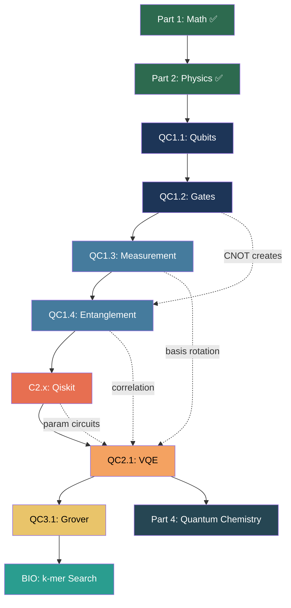

# ⚛️ Quantum Bioinformatics — Deep Chapter-wise Syllabus PART 3
## Phase 2: QC Theory + Qiskit (Weeks 11-18) + Phase 3: Algorithms (Weeks 19-26)

---

# PHASE 2: QUANTUM COMPUTING THEORY + QISKIT (Weeks 11-18)

---

## Module QC1.1: Qubits & Quantum States

> **PREREQUISITES: Part 1 (Math) + Part 2 (Physics) ALL gates passed.**
> You must know: complex numbers, vectors in ℂ², inner product, Born rule,
> |0⟩=[1,0]ᵀ, |1⟩=[0,1]ᵀ, |+⟩, |-⟩, matrix-vector multiplication.
> From Part 2: measurement postulate, eigenvalues, Pauli matrices.

```
QC1.1.1  The Qubit — Physical vs Mathematical
├── Classical bit vs Qubit (THE fundamental difference):
│   ┌──────────────────────┬──────────────────────────────────┐
│   │ Classical Bit         │ Qubit                            │
│   ├──────────────────────┼──────────────────────────────────┤
│   │ Value: 0 OR 1         │ Value: α|0⟩ + β|1⟩ (BOTH!)      │
│   │ State: bit b∈{0,1}    │ State: vector in ℂ²              │
│   │ Deterministic          │ Probabilistic until measured     │
│   │ Copy freely            │ NO-CLONING theorem              │
│   │ Read without changing  │ Measurement DESTROYS superposition│
│   │ n bits → n values      │ n qubits → 2ⁿ amplitudes       │
│   └──────────────────────┴──────────────────────────────────┘
│
├── General single-qubit state:
│   |ψ⟩ = α|0⟩ + β|1⟩     where α,β ∈ ℂ
│   Constraint: |α|² + |β|² = 1  (probabilities sum to 1)
│
│   WORKED EXAMPLES:
│   |ψ₁⟩ = |0⟩ → α=1, β=0. P(0)=1, P(1)=0.  (definitely |0⟩)
│   |ψ₂⟩ = |+⟩ = (1/√2)|0⟩+(1/√2)|1⟩ → P(0)=P(1)=1/2 (coin flip)
│   |ψ₃⟩ = (√3/2)|0⟩+(1/2)|1⟩ → P(0)=3/4, P(1)=1/4  (biased)
│   |ψ₄⟩ = (1/√2)|0⟩+(i/√2)|1⟩ → P(0)=P(1)=1/2 but DIFFERENT from |+⟩!
│   (Same probabilities, different PHASE → different physics)
│
├── Physical realizations (how real qubits work):
│   ┌─────────────────────┬────────────────────────────────────┐
│   │ Technology           │ What is |0⟩ and |1⟩                │
│   ├─────────────────────┼────────────────────────────────────┤
│   │ Superconducting (IBM)│ Current flowing ↻ or ↺ in loop    │
│   │ Trapped ion (IonQ)   │ Electron in ground vs excited state│
│   │ Photonic (Xanadu)    │ Polarization: horizontal/vertical  │
│   │ Spin qubit           │ Electron spin up ↑ or down ↓      │
│   └─────────────────────┴────────────────────────────────────┘
│   IBM Eagle processor: 127 superconducting qubits (2023)
│   IBM Heron: 133 qubits, 2-qubit error <1% (2024)
│
├── Code:
│   import numpy as np
│   from qiskit.quantum_info import Statevector
│   # Create various qubit states:
│   psi_0 = Statevector([1, 0])     # |0⟩
│   psi_plus = Statevector([1/np.sqrt(2), 1/np.sqrt(2)])  # |+⟩
│   psi_biased = Statevector([np.sqrt(3)/2, 1/2])         # 75/25 state
│   psi_phase = Statevector([1/np.sqrt(2), 1j/np.sqrt(2)]) # same probs, diff phase
│   for name, sv in [('|0⟩',psi_0),('|+⟩',psi_plus),('biased',psi_biased),('phase',psi_phase)]:
│       print(f"{name}: valid={sv.is_valid()}, probs={sv.probabilities()}")
│
└── Exit check:
    1. Is [0.6, 0.8] a valid qubit state? |0.6|²+|0.8|²=0.36+0.64=1 ✓
    2. Is [0.5, 0.5] valid? |0.5|²+|0.5|²=0.5 ≠ 1 ✗ (not normalized!)
    3. What is |α|² if α=(1+i)/2? |(1+i)/2|² = (1²+1²)/4 = 2/4 = 0.5

QC1.1.2  Bloch Sphere — The Qubit Visualization Tool
├── ANY single qubit state can be written as:
│   |ψ⟩ = cos(θ/2)|0⟩ + e^(iφ)·sin(θ/2)|1⟩
│   θ ∈ [0, π]:  polar angle (how far from north pole)
│   φ ∈ [0, 2π): azimuthal angle (which direction on equator)
│   → Every qubit maps to a point on a SPHERE (the Bloch sphere)
│
├── KEY STATES on the Bloch sphere (MEMORIZE):
│   ┌────────────────┬──────────────┬──────────────────────────┐
│   │ State          │ (θ, φ)       │ Bloch vector [x,y,z]     │
│   ├────────────────┼──────────────┼──────────────────────────┤
│   │ |0⟩            │ (0, -)       │ [0, 0, +1]  North pole   │
│   │ |1⟩            │ (π, -)       │ [0, 0, -1]  South pole   │
│   │ |+⟩            │ (π/2, 0)     │ [+1, 0, 0]  +x axis      │
│   │ |-⟩            │ (π/2, π)     │ [-1, 0, 0]  -x axis      │
│   │ |+i⟩=(|0⟩+i|1⟩)/√2│ (π/2, π/2)│ [0, +1, 0]  +y axis   │
│   │ |-i⟩=(|0⟩-i|1⟩)/√2│ (π/2, 3π/2)│[0, -1, 0]  -y axis   │
│   └────────────────┴──────────────┴──────────────────────────┘
│
├── WORKED EXAMPLE — find Bloch coordinates:
│   |ψ⟩ = (√3/2)|0⟩ + (1/2)|1⟩
│   cos(θ/2) = √3/2 → θ/2 = π/6 → θ = π/3
│   e^(iφ)·sin(θ/2) = 1/2 → e^(iφ)·(1/2) = 1/2 → e^(iφ) = 1 → φ = 0
│   Bloch: x=sin(π/3)cos(0)=√3/2, y=sin(π/3)sin(0)=0, z=cos(π/3)=1/2
│   → [√3/2, 0, 1/2] — between north pole and +x axis, upper hemisphere
│
├── Gates AS rotations on the Bloch sphere:
│   X gate = π rotation about x-axis: |0⟩ ↔ |1⟩ (north↔south)
│   Y gate = π rotation about y-axis: |0⟩ → i|1⟩
│   Z gate = π rotation about z-axis: |+⟩ ↔ |-⟩ (swaps +x and -x)
│   H gate = π rotation about (x+z)/√2 axis: |0⟩ ↔ |+⟩
│   Rx(θ) = rotation by θ about x-axis
│   Ry(θ) = rotation by θ about y-axis (moves from pole toward equator)
│   Rz(θ) = rotation by θ about z-axis (changes φ only)
│
├── Code:
│   from qiskit.visualization import plot_bloch_multivector
│   from qiskit.quantum_info import Statevector
│   # Visualize several states:
│   for state_label, sv in [('|0⟩', [1,0]), ('|+⟩', [1/np.sqrt(2), 1/np.sqrt(2)]),
│                            ('|+i⟩', [1/np.sqrt(2), 1j/np.sqrt(2)])]:
│       psi = Statevector(sv)
│       fig = plot_bloch_multivector(psi)
│       fig.suptitle(state_label)
│       fig.savefig(f'bloch_{state_label}.png')
│
└── Exit check:
    1. Where is Ry(π/2)|0⟩ on the Bloch sphere?
       Ry(π/2)|0⟩ = cos(π/4)|0⟩+sin(π/4)|1⟩ = |+⟩ → +x axis ✓
    2. Where is Rz(π/2)|+⟩?
       Rz(π/2) rotates by π/2 about z → |+⟩ goes to |+i⟩ (+y axis) ✓
    3. Plot all 6 key states on Bloch sphere using Qiskit.

QC1.1.3  Phase: Global vs Relative — The Subtlety That Makes Quantum Work
├── Global phase: e^(iα)|ψ⟩ is PHYSICALLY IDENTICAL to |ψ⟩
│   WHY? Born rule: P = |⟨φ|e^(iα)ψ⟩|² = |e^(iα)|²|⟨φ|ψ⟩|² = |⟨φ|ψ⟩|²
│   The e^(iα) cancels! → undetectable by any measurement
│   Example: |0⟩ and i|0⟩ and -|0⟩ are the SAME physical state
│
├── Relative phase: PHYSICALLY OBSERVABLE and CRUCIAL
│   |+⟩ = (1/√2)(|0⟩ + |1⟩)  → relative phase between |0⟩,|1⟩ is 0
│   |-⟩ = (1/√2)(|0⟩ - |1⟩)  → relative phase is π (the minus sign)
│   Same P(0)=P(1)=1/2 for BOTH states!
│   But ⟨X⟩ = +1 for |+⟩, ⟨X⟩ = -1 for |-⟩ → DIFFERENT measurements!
│
├── How relative phase arises:
│   Z gate: Z|+⟩ = Z(1/√2)(|0⟩+|1⟩) = (1/√2)(|0⟩-|1⟩) = |-⟩
│   Z didn't change probabilities but added π relative phase!
│   This is INVISIBLE in Z-measurement but VISIBLE in X-measurement
│
├── INTERFERENCE — why phase matters:
│   |ψ₁⟩ = (1/√2)(|0⟩+|1⟩) → apply H → H|+⟩ = |0⟩ (constructive)
│   |ψ₂⟩ = (1/√2)(|0⟩-|1⟩) → apply H → H|-⟩ = |1⟩ (destructive)
│   SAME probabilities before H, DIFFERENT outcomes after H!
│   This is quantum INTERFERENCE — the engine of all quantum speedups
│
├── VQE/Grover connection:
│   Grover oracle: marks target with -1 phase (relative phase change)
│   Diffuser: amplifies marked state via interference
│   VQE: rotation gate angles θ control relative phase → change ⟨H⟩
│
├── Code — demonstrating phase matters:
│   from qiskit import QuantumCircuit
│   from qiskit.quantum_info import Statevector
│   # State 1: |+⟩, then H → should give |0⟩
│   qc1 = QuantumCircuit(1); qc1.h(0); qc1.h(0)
│   print(Statevector(qc1))  # [1, 0] = |0⟩ ✓
│   # State 2: |-⟩, then H → should give |1⟩
│   qc2 = QuantumCircuit(1); qc2.x(0); qc2.h(0); qc2.h(0)
│   print(Statevector(qc2))  # [0, 1] = |1⟩ ✓
│   # Same probs (50/50) before final H, different outcomes!
│
└── Exit check:
    1. Are e^(iπ/4)|+⟩ and |+⟩ physically different? NO (global phase)
    2. Are |+⟩ and |-⟩ physically different? YES (relative phase)
    3. Apply H to (1/√2)(|0⟩+i|1⟩). What's the result?
       H[(1/√2)(|0⟩+i|1⟩)] = (1/2)[(1+i)|0⟩+(1-i)|1⟩]
       P(0) = |1+i|²/4 = 2/4 = 1/2, P(1) = 1/2 (equal, but different from |+⟩ case!)
    4. Verify in Qiskit code.

═══════════════════════════════════════════
 GATE TO QC1.2 — Do NOT proceed until ALL boxes checked:
═══════════════════════════════════════════
 □ Know: qubit = α|0⟩+β|1⟩ with |α|²+|β|²=1
 □ Can check if a vector is a valid qubit state
 □ Know 6 key Bloch sphere states (table above) from memory
 □ Can find θ,φ for a given state (e.g. (√3/2)|0⟩+(1/2)|1⟩ → θ=π/3, φ=0)
 □ Know: gates = rotations on Bloch sphere (X=x-rot, Z=z-rot, H=diagonal)
 □ Know: global phase undetectable; relative phase → interference
 □ Demonstrated interference: H|+⟩=|0⟩ vs H|-⟩=|1⟩ in code
 □ Created Statevector objects and used plot_bloch_multivector
═══════════════════════════════════════════
```

---

## Module QC1.2: Quantum Gates — Complete Reference

> **PREREQUISITES: QC1.1 gate passed.**
> Need: matrix-vector multiplication (M2.2), Pauli matrices (M2.3),
> Euler's formula (M1.1), unitary = U†U=I (M2.3).

```
QC1.2.1  Single-Qubit Gates — Complete Reference
├── PAULI GATES (memorize):
│   X = [[0,1],[1,0]]   "bit flip / NOT"
│     X|0⟩=|1⟩,  X|1⟩=|0⟩
│   Y = [[0,-i],[i,0]]  "bit+phase flip"
│     Y|0⟩=i|1⟩, Y|1⟩=-i|0⟩
│   Z = [[1,0],[0,-1]]  "phase flip"
│     Z|0⟩=|0⟩,  Z|1⟩=-|1⟩
│
├── PHASE GATES:
│   S = [[1,0],[0,i]]  (π/2 phase on |1⟩);  S²=Z
│   T = [[1,0],[0,e^(iπ/4)]]  (π/4 phase);  T²=S
│   Phase chain: T→T=S→S=Z→Z=I
│   WORKED: S|+⟩ = (1/√2)(|0⟩+i|1⟩) = |+i⟩ (rotated to +y)
│
├── HADAMARD:
│   H = (1/√2)[[1,1],[1,-1]]
│   H|0⟩=|+⟩, H|1⟩=|-⟩, H|+⟩=|0⟩, H|-⟩=|1⟩.  H²=I.
│   Key: H switches Z-basis ↔ X-basis
│
├── ROTATION GATES (VQE parameters live here):
│   Rx(θ) = [[cos(θ/2), -i·sin(θ/2)], [-i·sin(θ/2), cos(θ/2)]]
│   Ry(θ) = [[cos(θ/2), -sin(θ/2)], [sin(θ/2), cos(θ/2)]]
│   Rz(θ) = [[e^(-iθ/2), 0], [0, e^(iθ/2)]]
│   Ry(0)=I, Ry(π/3)|0⟩=(√3/2)|0⟩+(1/2)|1⟩, Ry(π)=-iY
│   VQE: optimizer adjusts θ₁,θ₂,... in Ry gates → minimize ⟨H⟩
│
├── UNIVERSAL SET: {H, T, CNOT} → ANY unitary (Solovay-Kitaev thm)
│
├── Code:
│   from qiskit import QuantumCircuit
│   from qiskit.quantum_info import Statevector, Operator
│   import numpy as np
│   qc = QuantumCircuit(1); qc.h(0); qc.s(0)
│   print(Statevector(qc))  # [0.707, 0.707j] = |+i⟩ ✓
│   T = Operator.from_label('T'); S = Operator.from_label('S')
│   print(np.allclose((T@T).data, S.data))  # True: T²=S ✓
│
└── Exit check:
    1. S|+⟩=? (answer: |+i⟩); T|+⟩=? (answer: (1/√2)(|0⟩+e^(iπ/4)|1⟩))
    2. Ry(π/3)|0⟩=? (answer: (√3/2)|0⟩+(1/2)|1⟩)
    3. Rz(π)|+⟩=? (answer: -i|-⟩ = |-⟩ up to global phase)

QC1.2.2  Two-Qubit Gates — Entanglement Creators
├── CNOT (CX) — MOST important 2-qubit gate:
│   4×4 matrix (basis |00⟩,|01⟩,|10⟩,|11⟩):
│   [[1,0,0,0],[0,1,0,0],[0,0,0,1],[0,0,1,0]]
│   Rule: target FLIPPED only if control=|1⟩
│   Truth table:
│   |00⟩→|00⟩, |01⟩→|01⟩, |10⟩→|11⟩, |11⟩→|10⟩
│
│   WORKED — Bell state |Φ+⟩ step by step:
│   Start:  |00⟩
│   H on q0: (1/√2)(|0⟩+|1⟩)⊗|0⟩ = (1/√2)(|00⟩+|10⟩)
│   CNOT:    (1/√2)(|00⟩+|11⟩) = |Φ+⟩  ✓
│   (|10⟩→|11⟩ because ctrl=1 flips target)
│
├── CZ: minus only on |11⟩ → CZ|11⟩=-|11⟩, rest unchanged
├── SWAP: exchanges qubits → SWAP|01⟩=|10⟩; decomp = 3 CNOTs
│
├── Hardware error reality:
│   ┌──────────────┬──────────┬───────────┐
│   │ Gate type     │ Error    │ Time      │
│   ├──────────────┼──────────┼───────────┤
│   │ 1-qubit (Rz) │ ~0.01%   │ ~20 ns    │
│   │ 2-qubit (CX) │ ~0.5-1%  │ ~200 ns   │
│   │ Measurement  │ ~1-2%    │ ~500 ns   │
│   └──────────────┴──────────┴───────────┘
│   → VQE circuit design = MINIMIZE 2-qubit gate count!
│
├── Code:
│   qc = QuantumCircuit(2); qc.h(0); qc.cx(0,1)
│   bell = Statevector(qc)
│   print(bell.data)           # [0.707, 0, 0, 0.707]
│   print(bell.probabilities())# [0.5, 0, 0, 0.5] ✓
│
└── Exit check:
    1. CNOT|+0⟩ = ? → |Φ+⟩ (Bell state)
    2. CNOT|-0⟩ = ? → |Φ-⟩ = (1/√2)(|00⟩-|11⟩)
    3. Verify CZ = (H⊗I)·CNOT·(H⊗I) using np.kron

QC1.2.3  Circuit Building in Qiskit
├── Reading circuit diagrams:
│   Left→right = time; lines = qubits; boxes = gates
│   Dot+⊕ = CNOT (dot=control, ⊕=target)
│
├── Qiskit API:
│   qc = QuantumCircuit(n_qubits, n_classical_bits)
│   qc.h(0); qc.x(1); qc.ry(theta, 0); qc.rz(phi, 1)
│   qc.s(0); qc.t(0)           # phase gates
│   qc.cx(0,1); qc.cz(0,1)     # 2-qubit
│   qc.measure(0, 0)            # qubit→classical
│   qc.measure_all()            # all qubits
│   qc.draw('mpl')              # matplotlib
│
├── Code — H⊗H superposition:
│   qc = QuantumCircuit(2); qc.h([0,1])
│   sv = Statevector(qc)
│   print(sv.probabilities())   # [0.25, 0.25, 0.25, 0.25] ✓
│
└── Exit check:
    Build circuits for:
    1. |00⟩ → equal superposition of all 4 basis states (H⊗H)
    2. |00⟩ → |Φ+⟩ Bell state (H, CNOT)
    3. |00⟩ → |Ψ+⟩ = (1/√2)(|01⟩+|10⟩) (X(0), H(0), CNOT(0,1))
    Draw all 3 with qc.draw('mpl').

═══════════════════════════════════════════
 GATE TO QC1.3 — Do NOT proceed until ALL boxes checked:
═══════════════════════════════════════════
 □ Write X,Y,Z,H,S,T matrices from memory
 □ Know: S²=Z, T²=S, H²=I
 □ Know Ry/Rz forms; can compute Ry(π/3)|0⟩ by hand
 □ Universal set: {H, T, CNOT} can build any gate
 □ CNOT truth table: |00⟩→|00⟩, |01⟩→|01⟩, |10⟩→|11⟩, |11⟩→|10⟩
 □ Created Bell state: H(0)→CNOT(0,1) gives |Φ+⟩
 □ Know hardware errors: 2-qubit ~10x worse → minimize in VQE
 □ Built and drew 3+ circuits in Qiskit
═══════════════════════════════════════════
```

## Module QC1.3: Quantum Measurement

```
QC1.3.1  Projective Measurement — Z Basis
├── Default measurement = computational (Z) basis
├── For state |ψ⟩ = α|0⟩ + β|1⟩:
│   P(outcome 0) = |α|²   → post-measurement state: |0⟩
│   P(outcome 1) = |β|²   → post-measurement state: |1⟩
│
├── Key: measurement DESTROYS superposition (irreversible!)
├── Multiple shots needed: 1 measurement gives 0 or 1, NOT probability
│   Need N shots → count(0)/N ≈ |α|²  (gets better as N→∞)
│
├── Code:
│   qc = QuantumCircuit(1, 1)
│   qc.h(0)           # |+⟩ state
│   qc.measure(0, 0)
│   from qiskit_aer import AerSimulator
│   sim = AerSimulator()
│   result = sim.run(qc, shots=10000).result()
│   counts = result.get_counts()
│   print(counts)  # {'0': ~5000, '1': ~5000}
│
└── Exit check: Verify P(|0⟩)=0.75 for |ψ⟩=(√3/2)|0⟩+(1/2)|1⟩ using 10000 shots.

QC1.3.2  Measuring in Different Bases
├── To measure in X-basis ({|+⟩,|-⟩}):
│   Apply H THEN measure in Z-basis
│   ⟨X⟩ measurement circuit: H → measure
│
├── To measure in Y-basis ({|i⟩,|-i⟩}):
│   Apply S†-H THEN measure in Z-basis
│   ⟨Y⟩ circuit: Sdg → H → measure
│
├── General: rotate to eigenbasis of observable, then Z-measure
│
└── VQE link: H_mol = Σₖ cₖ Pₖ (Pauli strings)
    Each Pₖ needs its own measurement circuit with basis rotations
    ⟨ZZX⟩: no rotation for Z qubits, H for X qubit, then measure all

QC1.3.3  Expectation Values — The VQE Cost Function
├── Estimator primitive (Qiskit 1.0+):
│   from qiskit.primitives import StatevectorEstimator
│   estimator = StatevectorEstimator()
│   job = estimator.run([(qc, observable)])
│   result = job.result()
│   energy = result[0].data.evs  # ⟨ψ|H|ψ⟩
│
├── For shot-based (real hardware):
│   from qiskit_ibm_runtime import EstimatorV2
│   # Same API, just different backend
│
└── Exit check:
    Circuit: Ry(π/3)|0⟩. Observable: Z.
    Compute ⟨Z⟩ analytically: cos(π/3) = 0.5.
    Verify with StatevectorEstimator.

═══════════════════════════════════════════
 GATE TO QC1.4 — Do NOT proceed until ALL boxes checked:
═══════════════════════════════════════════
 □ Know: Z-basis measurement gives |0⟩ or |1⟩ with P=|α|²,|β|²
 □ Know: measurement DESTROYS superposition (irreversible)
 □ Ran 10000-shot simulation, verified P≈0.75 for biased state
 □ Know: X-basis = H then Z-measure; Y-basis = Sdg→H then Z-measure  
 □ Know: VQE measures each Pauli string with basis rotation
 □ Used StatevectorEstimator to compute ⟨Z⟩ for Ry(π/3)|0⟩ = 0.5
═══════════════════════════════════════════
```

---

## Module QC1.4: Entanglement

```
QC1.4.1  Product States vs Entangled States
├── Product state: |ψ⟩ = |ψ_A⟩ ⊗ |ψ_B⟩ (can factor)
│   |00⟩ = |0⟩⊗|0⟩  ← product state
│
├── Entangled state: CANNOT factor
│   |Φ+⟩ = (1/√2)(|00⟩+|11⟩) ← testing:
│   If |Φ+⟩ = (α|0⟩+β|1⟩)⊗(γ|0⟩+δ|1⟩) = αγ|00⟩+αδ|01⟩+βγ|10⟩+βδ|11⟩
│   Need αδ=0, βγ=0, αγ=βδ=1/√2 → contradiction → entangled!
│
└── Schmidt decomposition: |ψ_AB⟩ = Σₖ √λₖ |uₖ⟩|vₖ⟩
    # of non-zero λₖ > 1 → entangled
    Entanglement entropy: S = -Σλₖ log λₖ

QC1.4.2  The Four Bell States
├── |Φ+⟩ = (1/√2)(|00⟩ + |11⟩)  circuit: H(0), CNOT(0,1)
├── |Φ-⟩ = (1/√2)(|00⟩ - |11⟩)  circuit: H(0), CNOT(0,1), Z(0)
├── |Ψ+⟩ = (1/√2)(|01⟩ + |10⟩)  circuit: H(0), CNOT(0,1), X(0)
├── |Ψ-⟩ = (1/√2)(|01⟩ - |10⟩)  circuit: H(0), CNOT(0,1), XZ(0)
│
└── All four: orthonormal, maximally entangled, form a complete basis

QC1.4.3  Why VQE Needs Entanglement
├── H₂ molecule: 2 electrons, each in LCAO orbital
│   Classical product state wavefunction = Hartree-Fock (HF) approximation
│   HF misses electron CORRELATION energy (entanglement effect)
│   HF error for H₂: ~0.054 Hartree (way above chemical accuracy)
│
├── VQE UCCSD ansatz explicitly includes correlated (entangled) terms
│   These model excitations: |0011⟩ ↔ |1100⟩ (orbital swaps)
│   This is exactly what entangling 2-qubit gates create!
│
└── BIO link:
    Aromatic rings (benzene, DNA bases): π-electron system is entangled
    Classical HF can't capture ring current, resonance stabilization properly
    Quantum simulation → correct reaction energies for DNA interstrand crosslinks

═══════════════════════════════════════════
 GATE TO C2.x — Do NOT proceed until ALL boxes checked:
═══════════════════════════════════════════
 □ Know: product state = factorable; entangled = cannot factor
 □ Can prove |Φ+⟩ entangled (contradiction argument)
 □ Know all 4 Bell states from memory with circuits
 □ VQE needs entanglement for electron correlation
 □ Hartree-Fock misses correlation energy → VQE fixes this
═══════════════════════════════════════════
```

---

## Module C2.1-C2.3: Qiskit — From Basics to Parameterized Circuits

```
C2.1  Qiskit Environment Setup
├── Install:
│   pip install qiskit qiskit-aer qiskit-ibm-runtime qiskit-nature pyscf
│
├── Basic imports:
│   from qiskit import QuantumCircuit, transpile
│   from qiskit.quantum_info import Statevector, Operator
│   from qiskit_aer import AerSimulator
│
├── First circuit — verify setup:
│   qc = QuantumCircuit(2)
│   qc.h(0); qc.cx(0,1)
│   sv = Statevector(qc)
│   print(sv)  # Statevector([0.707+0j, 0, 0, 0.707+0j])
│
└── If import fails: check Python 3.9+ and pip install --upgrade qiskit

C2.2  Qiskit Simulators — When to Use Each
├── StatevectorSimulator:
│   Stores full 2ⁿ-dim state vector
│   Exact (no noise, no sampling), max ≈ 30 qubits (RAM limited)
│   USE: VQE development and debugging
│
├── QASMSimulator / AerSimulator (shot-based):
│   Samples outcomes N times (like real hardware)
│   Output: counts dict {'00': 512, '11': 488}
│   USE: Realistic simulation, checking measurement circuits
│
├── Noise model simulation:
│   from qiskit_aer.noise import NoiseModel
│   from qiskit_ibm_runtime.fake_provider import FakeWashingtonV2
│   backend = FakeWashingtonV2()
│   noise_model = NoiseModel.from_backend(backend)
│   USE: Approximate real hardware NISQ behavior
│
└── Code — compare exact vs shot:
    qc = QuantumCircuit(1, 1); qc.h(0); qc.measure(0, 0)
    # Exact
    sv = Statevector(QuantumCircuit(1).h(0))
    print(sv.probabilities())  # [0.5, 0.5]
    # Shot-based
    result = AerSimulator().run(qc, shots=1000).result()
    print(result.get_counts())  # {'0': ~500, '1': ~500}

C2.3  Parameterized Circuits — The Core of VQE
├── Why parameterized:
│   VQE ansatz |ψ(θ)⟩ depends on continuous parameters θ = (θ₁,...,θₙ)
│   We need to OPTIMIZE these parameters → need to evaluate for many θ
│   Parameterized circuit = template, fill in θ at runtime
│
├── Building parameterized circuits:
│   from qiskit.circuit import ParameterVector, Parameter
│   theta = ParameterVector('θ', 4)  # 4 parameters
│   qc = QuantumCircuit(2)
│   qc.ry(theta[0], 0)
│   qc.ry(theta[1], 1)
│   qc.cx(0, 1)
│   qc.ry(theta[2], 0)
│   qc.ry(theta[3], 1)
│
├── Assigning parameters:
│   bound_qc = qc.assign_parameters({theta: [0.1, 0.2, 0.3, 0.4]})
│
├── Parameter-shift gradient rule:
│   ∂⟨E⟩/∂θₖ = [⟨E(θₖ + π/2)⟩ - ⟨E(θₖ - π/2)⟩] / 2
│   This gives EXACT gradient on real hardware (no finite difference needed!)
│
└── MINI VQE (Toy Problem):
    # Find ground state of H = Z (eigenvalue -1 at |1⟩)
    theta = Parameter('θ')
    qc = QuantumCircuit(1)
    qc.ry(theta, 0)   # ansatz: Ry(θ)|0⟩
    # Cost: ⟨Z⟩ = ⟨0|Ry(-θ)ZRy(θ)|0⟩ = cos(θ)
    # Minimize cos(θ) → θ=π → |ψ(π)⟩=|1⟩, ⟨Z⟩=-1 ✓
    # THIS IS VQE LOGIC IN ITS SIMPLEST FORM

═══════════════════════════════════════════
 GATE TO QC2.1 — Do NOT proceed until ALL boxes checked:
═══════════════════════════════════════════
 □ Qiskit installed; Bell state circuit runs
 □ Know 3 simulators: Statevector, Aer (shots), Noise model
 □ Built parameterized circuit with ParameterVector
 □ Used assign_parameters() to bind values
 □ Know parameter-shift: ∂E/∂θ = [E(θ+π/2)-E(θ-π/2)]/2
 □ Mini VQE: H=Z, ansatz=Ry(θ), θ=π gives ⟨Z⟩=-1
═══════════════════════════════════════════
```

---

# PHASE 3: QC ALGORITHMS (Weeks 19-26)

---

## Module QC2.1: Variational Principle — The Foundation of VQE

```
QC2.1.1  Rayleigh-Ritz Variational Principle
├── Statement:
│   For ANY normalized state |ψ⟩: ⟨ψ|H|ψ⟩ ≥ E₀
│   where E₀ is the TRUE ground state energy
│
├── Proof:
│   Expand |ψ⟩ in energy eigenstates: |ψ⟩ = Σₙ cₙ|Eₙ⟩
│   ⟨ψ|H|ψ⟩ = Σₙ |cₙ|² Eₙ   (H acts on each eigenstate)
│   Since E₀ ≤ Eₙ for all n:
│   Σₙ |cₙ|² Eₙ ≥ Σₙ |cₙ|² E₀ = E₀ · Σₙ|cₙ|² = E₀  ✓
│   (Used: Σₙ|cₙ|² = 1 by normalization)
│
├── Key consequence:
│   Minimize ⟨ψ(θ)|H|ψ(θ)⟩ over θ → approach E₀ from above
│   More expressive ansatz → closer to true E₀
│
└── Analogy:
    You're guessing what the lowest point on a landscape is.
    You can check height at any point.
    Keep picking points until you find the lowest you can reach.
    VQE is this process on quantum hardware.

QC2.1.2  Ansatz Design — What Makes a Good Ansatz
├── Requirements:
│   1. Expressibility: can reach states close to true ground state
│   2. Efficiency: few gates, low circuit depth (NISQ constraint)
│   3. Trainability: gradients don't vanish (avoid barren plateaus)
│
├── Hardware-Efficient Ansatz (HEA):
│   Layer structure: [Ry]⊗n → CNOT_entangling → [Ry]⊗n → ...
│   Number of parameters: O(n × depth)
│   Pros: Native gate set, low depth
│   Cons: May not capture true ground state chemistry
│
├── UCCSD (Unitary Coupled Cluster Singles Doubles):
│   Chemistry-motivated: models single/double electron excitations
│   For H₂ (4 spin-orbitals): 1 parameter, 1 CNOT
│   For larger molecules: exponentially many terms (classically intractable)
│   Qiskit: from qiskit_nature.second_q.circuit.library import UCCSD
│
└── Code (EfficientSU2 built-in):
    from qiskit.circuit.library import EfficientSU2
    ansatz = EfficientSU2(num_qubits=4, reps=2)
    print(f"Parameters: {ansatz.num_parameters}")  # shows count
    ansatz.decompose().draw('mpl')

QC2.1.3  Classical Optimizers in VQE
├── COBYLA (Constrained Optimization By Linear Approximations):
│   Derivative-free, robust to shot noise
│   Best for: small circuits, hardware runs
│   Starting choice for VQE
│   from scipy.optimize import minimize
│   minimize(cost_fn, x0, method='COBYLA')
│
├── SPSA (Simultaneous Perturbation Stochastic Approximation):
│   Uses only 2 cost evaluations per gradient step (vs 2n for param-shift)
│   Good for hardware with many parameters
│
├── Adam (gradient-based):
│   Uses param-shift for gradients
│   Faster convergence than COBYLA for smooth landscapes
│   from qiskit_algorithms.optimizers import ADAM
│
├── Barren plateau problem:
│   For random initial parameters on n-qubit circuits:
│   ∂E/∂θₖ → 0 exponentially fast as n increases
│   Gradient is exponentially small → training fails!
│   Solutions: layerwise training, problem-specific init, shallow circuits
│
└── Exit check (VQE Gate Exam):
    H = 0.5·(Z⊗Z) + 0.5·(X⊗I)  [create as SparsePauliOp]
    Ansatz: Ry(θ₁)⊗Ry(θ₂) → CNOT
    Find ground state energy using COBYLA. Compare to exact eigvals.

═══════════════════════════════════════════
 GATE TO QC3.1 — Do NOT proceed until ALL boxes checked:
═══════════════════════════════════════════
 □ Know variational principle: ⟨ψ|H|ψ⟩ ≥ E₀ for all |ψ⟩
 □ Know 3 ansatz needs: expressibility, efficiency, trainability
 □ Know HEA vs UCCSD tradeoffs
 □ Know COBYLA vs SPSA vs Adam
 □ Know barren plateau problem and mitigations
 □ Ran full VQE on 2-qubit Hamiltonian
═══════════════════════════════════════════
```

---

## Module QC3.1: Grover's Algorithm

```
QC3.1.1  Unstructured Search — Classical vs Quantum
├── Problem: N items in unsorted database, 1 marked item (f(x)=1)
│   Classical: check items one by one → O(N) queries
│   Quantum: Grover → O(√N) queries → quadratic speedup
│
├── For N=10⁶: classical=10⁶ checks, Grover=1000 checks
│   For human genome (N=3×10⁹ bp k-mers): 3×10⁹ vs 55,000 queries
│
└── This is THE proven quantum speedup with widest applicability

QC3.1.2  The Oracle — Marking Target States
├── Phase oracle: Uf|x⟩ = (-1)^f(x)|x⟩
│   f(x)=0 (not target): state unchanged
│   f(x)=1 (target x*): amplitude gets multiplied by -1
│
├── Oracle for |11⟩ = CZ gate (marks |11⟩ with -1 phase):
│   from qiskit import QuantumCircuit
│   oracle = QuantumCircuit(2)
│   oracle.cz(0, 1)   # flips phase of |11⟩ only
│
├── Phase kickback trick:
│   Target qubit in |-⟩ = (1/√2)(|0⟩-|1⟩)
│   CNOT from control: |c⟩|-⟩ → (-1)^c|c⟩|-⟩
│   Phase "kicks back" to control qubit!
│
└── Generalizing: oracle for string |w₁w₂...wₙ⟩:
    Apply X to qubits where wᵢ=0, then n-controlled-Z, then X again

QC3.1.3  The Diffuser — Inversion About Mean
├── W = 2|ψ⟩⟨ψ| - I  where |ψ⟩ = H⊗ⁿ|0...0⟩ (uniform superposition)
├── Effect: reflects about mean amplitude
│   Small amplitudes pushed more negative
│   Large amplitudes boosted
│   Iterating: target amplitude grows, others shrink
│
├── Circuit for n qubits:
│   H⊗ⁿ → X⊗ⁿ → n-controlled-Z → X⊗ⁿ → H⊗ⁿ
│
└── Code (Grover on 2 qubits, target |11⟩):
    qc = QuantumCircuit(2)
    # Superposition
    qc.h([0,1])
    # Oracle (CZ marks |11⟩)
    qc.cz(0,1)
    # Diffuser
    qc.h([0,1]); qc.x([0,1])
    qc.h(1); qc.cx(0,1); qc.h(1)   # 2-qubit controlled-Z
    qc.x([0,1]); qc.h([0,1])
    # Measure
    qc.measure_all()
    # For N=4, 1 iteration. Should get |11⟩ with ~100% probability

QC3.1.4  BIO Application — Genomic k-mer Search
├── Problem: find specific DNA k-mer in genome database
│   k=20 bp: N=4²⁰ ≈ 10¹² possible k-mers → massive search space
│
├── Quantum approach:
│   Encode each k-mer as a quantum state using 2k qubits (2 bits/nucleotide)
│   A=00, T=11, C=01, G=10
│   Oracle: phase-mark the target k-mer
│   Grover iterations: O(√N) ≈ O(√4^k) = O(2^k) — better than classical 4^k
│
└── Active research: major challenge = QRAM (quantum random access memory)
    Loading the database into superposition is itself an O(N) operation
    Quantum advantage only realized if QRAM loading is efficient

═══════════════════════════════════════════
 ⭐ MASTER QC GATE — PART 3 COMPLETE ⭐
═══════════════════════════════════════════
 □ QC1.1: Qubit states, Bloch sphere, phase
 □ QC1.2: All gates, universal set, CNOT
 □ QC1.3: Measurement, basis rotation, expectation
 □ QC1.4: Entanglement, Bell states
 □ C2.x: Qiskit, simulators, parameterized circuits
 □ QC2.1: Variational principle, ansatz, optimizers
 □ QC3.1: Grover oracle, diffuser, bio app
═══════════════════════════════════════════
```

---

# ✅ COMPLETE TO-DO LIST — PART 3 (QC THEORY + ALGORITHMS)

## QC1.1 Qubits
- [ ] Classical bit vs qubit table
- [ ] |ψ⟩=α|0⟩+β|1⟩; normalization check
- [ ] Physical realizations (4 types)
- [ ] Statevector in Qiskit
- [ ] Bloch sphere 6 states memorized
- [ ] Find θ,φ for given state by hand
- [ ] Gates = rotations on Bloch
- [ ] Global vs relative phase
- [ ] Interference demo: H|+⟩=|0⟩ vs H|-⟩=|1⟩
- [ ] QC1.1 GATE ✓

## QC1.2 Gates
- [ ] X,Y,Z,H,S,T matrices from memory
- [ ] S²=Z, T²=S, H²=I
- [ ] S|+⟩=|+i⟩ by hand
- [ ] Ry(θ), Rz(θ) forms; Ry(π/3)|0⟩ by hand
- [ ] Universal set {H,T,CNOT}
- [ ] CNOT truth table; 4×4 matrix
- [ ] Bell state step-by-step
- [ ] CZ, SWAP gates
- [ ] Hardware error rates table
- [ ] 3 circuits built and drawn
- [ ] QC1.2 GATE ✓

## QC1.3 Measurement
- [ ] Z-basis: P(0)=|α|², destroys superposition
- [ ] 10000-shot verification
- [ ] X-basis = H→Z; Y-basis = Sdg→H→Z
- [ ] VQE Pauli string measurement
- [ ] StatevectorEstimator: ⟨Z⟩ for Ry(π/3)|0⟩
- [ ] QC1.3 GATE ✓

## QC1.4 Entanglement
- [ ] Product vs entangled; prove |Φ+⟩ entangled
- [ ] Schmidt decomposition concept
- [ ] 4 Bell states from memory + circuits
- [ ] VQE needs entanglement (correlation energy)
- [ ] BIO: DNA π-electrons
- [ ] QC1.4 GATE ✓

## C2.x Qiskit
- [ ] Install + first circuit
- [ ] 3 simulator types
- [ ] Parameterized circuit with ParameterVector
- [ ] assign_parameters()
- [ ] Parameter-shift gradient rule
- [ ] Mini VQE: H=Z, Ry(θ), θ=π →⟨Z⟩=-1
- [ ] C2.x GATE ✓

## QC2.1 VQE
- [ ] Variational principle proof
- [ ] HEA vs UCCSD ansatz
- [ ] EfficientSU2 from library
- [ ] COBYLA, SPSA, Adam optimizers
- [ ] Barren plateau problem
- [ ] Full 2-qubit VQE run
- [ ] QC2.1 GATE ✓

## QC3.1 Grover
- [ ] Classical O(N) vs quantum O(√N)
- [ ] Phase oracle construction
- [ ] Phase kickback
- [ ] Diffuser circuit
- [ ] 2-qubit Grover code
- [ ] Optimal iterations ≈(π/4)√N
- [ ] BIO: k-mer search + QRAM challenge
- [ ] QC3.1 GATE ✓

---

## ⭐ MASTER SIGN-OFF — PART 3

- [ ] All 7 module gates passed
- [ ] Can build circuits in Qiskit
- [ ] Mini VQE + full VQE completed
- [ ] Grover coded and tested
- [ ] **READY FOR PART 4 — QUANTUM CHEMISTRY 🚀**

---

## 🌳 Part 3 Module Dependency Tree



