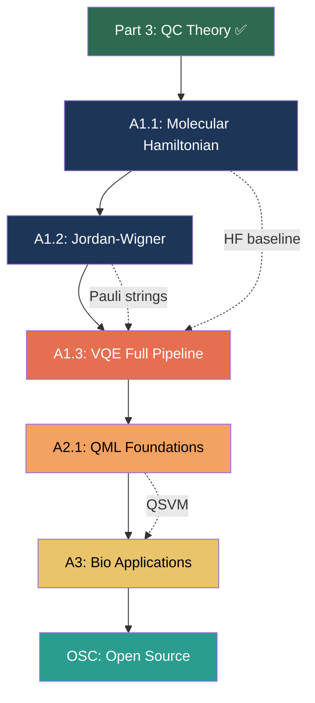

# ⚛️ Quantum Bioinformatics — Deep Chapter-wise Syllabus PART 4
## Phase 4: VQE Implementation (Weeks 27-36) + Phase 5: QML + Bio Applications

---

# PHASE 4: VQE IMPLEMENTATION (Weeks 27-36)

---

## Module A1.1: Molecular Hamiltonian Construction

```
A1.1.1  Born-Oppenheimer Approximation
├── What to learn:
│   ├── Electrons are ~1836× lighter than protons → move much faster
│   ├── Approximation: treat nuclear positions as FIXED parameters
│   ├── Solve electronic Schrödinger equation at each nuclear geometry
│   ├── Electronic Hamiltonian (in atomic units ℏ=mₑ=e=1):
│   │   Ĥₑₗ = -½Σᵢ∇ᵢ² - Σᵢ,I ZI/rᵢI + Σᵢ<ⱼ 1/rᵢⱼ + Σᴵ<ᴶ ZIZJ/RIJ
│   │   ↑ KE        ↑ electron-nuclear   ↑ electron-electron  ↑ nuclear repulsion
│   └── Result: E(nuclear geometry) = f(bond lengths, angles)
│
├── Chemical intuition:
│   H₂ at equilibrium (0.74 Å): Hamiltonian at this geometry → ground state energy
│   Scan over bond lengths 0.3→3.0 Å → bond dissociation curve
│   Minimum of curve = equilibrium bond length and binding energy
│
└── Code setup:
    pip install qiskit-nature pyscf
    # PySCF: classical quantum chemistry package (does the integrals)
    # Qiskit Nature: interface to VQE solve

A1.1.2  Second Quantization
├── First quantization: solve for wavefunction ψ(r₁,r₂,...,rₙ)
│   Problem: antisymmetry! Fermions: ψ(r₁,r₂)=-ψ(r₂,r₁)
│   For N electrons: 3N-dimensional function (exponentially hard)
│
├── Second quantization: work with OCCUPATION NUMBERS
│   Basis: spin orbitals φ₁,φ₂,...,φₖ (from Hartree-Fock calculation)
│   State: |n₁n₂...nₖ⟩ where nᵢ ∈ {0,1} (occupied or empty)
│   H₂ minimal (STO-3G): 2 spatial orbitals × 2 spins = 4 spin-orbitals
│   State space: 2⁴ = 16 basis states
│
├── Creation/annihilation operators:
│   â†ᵢ: creates electron in spin-orbital i  (if already occupied: gives 0)
│   âᵢ:  destroys electron in spin-orbital i (if empty: gives 0)
│   Anticommutation: {â†ᵢ, âⱼ} = δᵢⱼ  (fermionic property)
│
├── Second quantized Hamiltonian:
│   H = Σᵢⱼ hᵢⱼ â†ᵢâⱼ + ½Σᵢⱼₖₗ gᵢⱼₖₗ â†ᵢâ†ⱼâₖâₗ
│   hᵢⱼ: one-electron integrals (kinetic + electron-nuclear)
│   gᵢⱼₖₗ: two-electron integrals (electron-electron repulsion)
│   Computed by PySCF from atomic basis set
│
└── Code:
    from qiskit_nature.second_q.drivers import PySCFDriver
    from qiskit_nature.units import DistanceUnit
    driver = PySCFDriver(
        atom="H 0 0 0; H 0 0 0.74",  # H₂ at 0.74 Å
        basis="sto3g",
        unit=DistanceUnit.ANGSTROM
    )
    problem = driver.run()
    ham = problem.hamiltonian
    print(ham.electronic_integrals)

A1.1.3  Basis Sets — Choosing Approximation Level
├── Basis set = mathematical functions to represent atomic orbitals
│
├── STO-3G (minimal):
│   3 Gaussian functions per orbital
│   H₂: 2 spatial orbitals → 4 spin-orbitals → 4 qubits
│   Fast, low accuracy. Use for VQE learning.
│
├── 6-31G (split valence):
│   Two different sizes of Gaussian per orbital
│   More accurate, more qubits needed
│   H₂: 4 spatial → 8 spin-orbitals → 8 qubits
│
├── cc-pVDZ (correlation consistent):
│   Research quality. Common in papers.
│   H₂: 5 spatial → 10 spin-orbitals → 10 qubits
│
└── Rule: use STO-3G for VQE development, 6-31G for publication comparison

A1.1.4  Hartree-Fock Theory — The Classical Baseline VQE Must Beat
├── What HF does:
│   Approximates N-electron wavefunction as SINGLE Slater determinant
│   Each electron sees AVERAGE field of all others (mean-field)
│   Iterates until self-consistent (SCF = Self-Consistent Field)
│
├── Key concepts:
│   Slater determinant: antisymmetric product of N orbitals
│   ψ_HF = (1/√N!) det[φ₁(r₁) φ₂(r₂) ... φₙ(rₙ)]
│   Fock operator: F̂ = ĥ + Σⱼ(Ĵⱼ - K̂ⱼ)
│   ĥ = kinetic + nuclear attraction (1-electron)
│   Ĵⱼ = Coulomb operator (average repulsion from electron j)
│   K̂ⱼ = Exchange operator (quantum correction, no classical analog!)
│
├── SCF iteration:
│   1. Guess initial orbitals (e.g., core Hamiltonian diag)
│   2. Build Fock matrix from current orbitals
│   3. Diagonalize → new orbitals
│   4. Repeat 2-3 until energy converges (<10⁻⁸ Hartree)
│   Typically: 10-30 iterations
│
├── What HF MISSES — correlation energy:
│   E_exact = E_HF + E_correlation
│   E_correlation is ALWAYS negative (HF overestimates energy)
│   For H₂: E_HF ≈ -1.117 Ha, E_exact ≈ -1.174 Ha → corr ≈ -0.057 Ha
│   Chemical accuracy = 1.6 mHa = 0.0016 Ha → HF error 35× too large!
│
├── Methods to capture correlation:
│   ┌─────────────┬──────────────┬───────────────┬────────────────┐
│   │ Method       │ Accuracy     │ Scaling       │ On QC?         │
│   ├─────────────┼──────────────┼───────────────┼────────────────┤
│   │ HF           │ ~95% E_total │ O(N³)         │ No (classical) │
│   │ MP2          │ ~99%         │ O(N⁵)         │ No             │
│   │ CCSD         │ ~99.5%       │ O(N⁶)         │ No             │
│   │ CCSD(T)      │ ~99.9% "gold"│ O(N⁷)         │ No             │
│   │ FCI (exact)  │ 100%         │ O(exp(N))     │ No             │
│   │ VQE          │ variable     │ O(poly) on QC │ YES!           │
│   └─────────────┴──────────────┴───────────────┴────────────────┘
│   VQE advantage: polynomial on quantum hardware where FCI is exponential
│
├── Code (HF in PySCF):
│   from pyscf import gto, scf
│   mol = gto.M(atom='H 0 0 0; H 0 0 0.74', basis='sto-3g')
│   mf = scf.RHF(mol)
│   E_hf = mf.kernel()
│   print(f"HF energy: {E_hf:.6f} Ha")  # ≈ -1.117 Ha
│   # Compare: FCI
│   from pyscf import fci
│   E_fci, _ = fci.FCI(mf).kernel()
│   print(f"FCI energy: {E_fci:.6f} Ha")  # ≈ -1.174 Ha
│   print(f"Correlation: {(E_fci-E_hf)*1000:.1f} mHa")  # ≈ -57 mHa
│
└── Exit check:
    1. Run HF + FCI for H₂ at bond length 0.74 Å → compute correlation energy
    2. Know: VQE must get within 1.6 mHa of FCI to be "chemically accurate"
    3. Know: HF fails badly at bond dissociation (stretching H₂ to 3.0 Å)

```

---

## Module A1.2: Jordan-Wigner Transformation

```
A1.2.1  Why We Need Mapping
├── Problem: quantum computers use QUBITS, not fermionic operators
│   Qubits: [σ⁺ᵢ, σ⁻ⱼ] = 2σᶻᵢδᵢⱼ (bosonic-like commutation)
│   Fermions: {â†ᵢ, âⱼ} = δᵢⱼ (anticommutation!)
│   DIFFERENT algebras → need translation
│
└── Jordan-Wigner provides exact mapping of fermionic → qubit operators

A1.2.2  The Jordan-Wigner Mapping
├── Mapping (spin-orbital j → qubit j):
│   â†ⱼ → (Z⊗...⊗Z)_(0 to j-1) ⊗ σ⁺ⱼ = (Z⊗ⁱ⁻¹ ⊗ X-iY)/2
│   âⱼ  → (Z⊗...⊗Z)_(0 to j-1) ⊗ σ⁻ⱼ
│   Occupation â†ⱼâⱼ → (I-Zⱼ)/2
│
├── Z-string effect:
│   The Z⊗Z⊗...⊗Z string enforces fermionic antisymmetry
│   It counts how many orbitals below j are occupied
│   → flips phase appropriately
│
├── Result: H_fermionic → H_qubit = Σₖ cₖ Pₖ (linear combo of Pauli strings)
│
├── H₂ STO-3G after mapping (4 qubits, 4 conservation symmetries):
│   H ≈ -0.810*II + 0.172*ZI + -0.222*IZ + 0.171*ZZ + 0.120*XX + 0.120*YY
│   (coefficients from PySCF at equilibrium geometry)
│
└── Code:
    from qiskit_nature.second_q.mappers import JordanWignerMapper
    mapper = JordanWignerMapper()
    qubit_op = mapper.map(problem.hamiltonian.second_q_op())
    print(qubit_op)     # SparsePauliOp

A1.2.3  Symmetry Reduction — Qubit Tapering
├── H₂ STO-3G: 4 spin-orbitals → 4 qubits naively
│   But: N electrons AND Sz are conserved → 2 qubits are redundant!
│
├── TwoQubitReduction: exploits Z₂ symmetries to reduce by 2 qubits
│   4 qubits → 2 qubits  (for H₂ STO-3G)
│   This makes circuit shallower and more NISQ-friendly
│
└── Code:
    from qiskit_nature.second_q.mappers import ParityMapper
    mapper = ParityMapper(num_particles=problem.num_particles)
    qubit_op = mapper.map(problem.hamiltonian.second_q_op())
    print(f"Qubits after reduction: {qubit_op.num_qubits}")  # 2 for H₂!
```

---

## Module A1.3: VQE Full Implementation ⛔ MASTER CHECKPOINT

```
A1.3.1  Complete VQE Pipeline — Step by Step
├── Step 1: Molecular setup
│   driver = PySCFDriver(atom="H 0 0 0; H 0 0 0.735", basis="sto3g")
│   prob = driver.run()
│
├── Step 2: Qubit mapping (with symmetry reduction)
│   mapper = ParityMapper(num_particles=prob.num_particles)
│   hamiltonian = mapper.map(prob.hamiltonian.second_q_op())
│   # Result: 2-qubit SparsePauliOp for H₂
│
├── Step 3: Ansatz circuit
│   from qiskit.circuit.library import EfficientSU2
│   ansatz = EfficientSU2(num_qubits=2, reps=1)
│   # OR: UCCSD (more accurate but deeper)
│   from qiskit_nature.second_q.circuit.library import UCCSD
│   ansatz = UCCSD(num_spatial_orbitals=2, num_particles=(1,1), mapper=mapper)
│
├── Step 4: Cost function
│   from qiskit.primitives import StatevectorEstimator
│   estimator = StatevectorEstimator()
│   def cost(params):
│       bound = ansatz.assign_parameters(params)
│       job = estimator.run([(bound, hamiltonian)])
│       return job.result()[0].data.evs
│
├── Step 5: Optimize
│   from scipy.optimize import minimize
│   import numpy as np
│   x0 = np.random.uniform(-np.pi, np.pi, ansatz.num_parameters)
│   result = minimize(cost, x0, method='COBYLA',
│                     options={'maxiter': 1000, 'rhobeg': 0.1})
│   print(f"VQE energy: {result.fun:.6f} Ha")
│
├── Step 6: Reference (exact)
│   from qiskit_algorithms import NumPyMinimumEigensolver
│   exact = NumPyMinimumEigensolver().compute_minimum_eigenvalue(hamiltonian)
│   print(f"Exact energy: {exact.eigenvalue:.6f} Ha")
│   print(f"Error: {abs(result.fun - exact.eigenvalue.real)*1000:.3f} mHa")
│
└── PASS criteria: error < 1.6 mHa ("chemical accuracy")

A1.3.2  Bond Dissociation Curve Analysis
├── Scan bond length from 0.5 Å to 3.0 Å:
│   bond_lengths = np.linspace(0.5, 3.0, 20)
│   vqe_energies, exact_energies = [], []
│   for r in bond_lengths:
│       driver = PySCFDriver(atom=f"H 0 0 0; H 0 0 {r}", basis="sto3g")
│       # [run VQE pipeline for each r]
│       vqe_energies.append(...)
│       exact_energies.append(...)
│   plt.plot(bond_lengths, vqe_energies, label='VQE')
│   plt.plot(bond_lengths, exact_energies, label='Exact FCI')
│   plt.xlabel('Bond Length (Å)'); plt.ylabel('Energy (Hartree)')
│   plt.legend(); plt.show()
│
└── Expected:
    Both curves track each other. VQE lies slightly ABOVE exact (variational!).
    Error largest near dissociation (strongly correlated, ansatz less expressive).
    Minimum of curve = equilibrium bond length ≈ 0.74 Å for H₂.

═══════════════════════════════════════════
 ⛔ VQE MASTER CHECKPOINT:
═══════════════════════════════════════════
 □ Run HF + FCI for H₂ → know correlation energy
 □ Know second quantization: occupation numbers, creation/annihilation
 □ Know Jordan-Wigner: fermionic→qubit mapping
 □ Built complete VQE pipeline (5 steps)
 □ Achieved chemical accuracy (<1.6 mHa error)
 □ Bond dissociation curve: VQE tracks FCI
 □ Know basis sets: STO-3G vs 6-31G vs cc-pVDZ
═══════════════════════════════════════════
```

---

# PHASE 5: QML + BIOINFORMATICS APPLICATIONS (Months 10-24)

---

## Module A2.1: Quantum Machine Learning Foundations

```
A2.1.1  Data Encoding — The Core QML Design Choice
├── Angle encoding:
│   Single qubit per feature. Feature xᵢ → Ry(xᵢ)|0⟩
│   N features = N qubits
│   Simple, most practical for NISQ
│   qc.ry(x[i], i) for each feature i
│
├── Amplitude encoding:
│   N features → log₂N qubits (exponential compression!)
│   Full data vector normalized into quantum state amplitudes
│   |ψ⟩ = (1/||x||) Σᵢ xᵢ|i⟩
│   Problem: state preparation circuit is hard to build efficiently
│
├── ZZ-feature map (Qiskit default for QSVM):
│   2nd order expansion, creates quantum kernel
│   For each pair (i,j): RZ(2(π-xᵢ)(π-xⱼ))·CZ between qubits i and j
│   Captures pairwise correlations in data
│   from qiskit.circuit.library import ZZFeatureMap
│   feature_map = ZZFeatureMap(feature_dimension=4, reps=2)
│
└── BIO encoding consideration:
    Genomic data: one-hot encode nucleotides (A=0.0, T=1.0, C=0.5, G=0.75)?
    Gene expression: normalize to [-π, π] then angle encode
    Amino acid properties (hydrophobicity, charge) as continuous features

A2.1.2  Quantum Kernel Methods (QSVM)
├── Classical SVM recap:
│   Decision boundary: maximize margin between classes
│   Kernel trick: K(x,y) = ⟨φ(x),φ(y)⟩ maps to high-dim feature space
│   Never explicitly compute φ(x)!
│
├── Quantum kernel:
│   K(x,y) = |⟨ψ(x)|ψ(y)⟩|² = |⟨0|U†(x)U(y)|0⟩|²
│   U(x) = feature map circuit encoding data x
│   Compute: run U†(x)U(y) on QC, measure P(|0...0⟩) → kernel value
│
├── Full QSVM pipeline:
│   from qiskit_machine_learning.kernels import FidelityQuantumKernel
│   from sklearn.svm import SVC
│   kernel = FidelityQuantumKernel(feature_map=ZZFeatureMap(n))
│   K_train = kernel.evaluate(X_train)
│   K_test = kernel.evaluate(X_test, X_train)
│   svm = SVC(kernel='precomputed').fit(K_train, y_train)
│   accuracy = svm.score(K_test, y_test)
│
└── BIO application:
    Encode 10 gene expression features from GEO dataset
    QSVM → classify BRCA1 mutant vs wild-type
    Compare AUC vs classical RBF-SVM kernel

A2.1.3  Quantum Neural Networks (QNN)
├── PQC-as-QNN logic:
│   Classical NN: input → (W·x+b) → activation → output
│   QNN: input encoded by U(x) → parameterized U(θ) → measure ⟨O⟩ → output
│
├── PennyLane (better library for QNN):
│   pip install pennylane pennylane-qiskit
│   import pennylane as qml
│   device = qml.device("default.qubit", wires=4)
│   @qml.qnode(device)
│   def circuit(x, theta):
│       qml.AngleEmbedding(x, wires=range(4))   # encode data
│       qml.StronglyEntanglingLayers(theta, wires=range(4))  # ansatz
│       return qml.expval(qml.PauliZ(0))  # output
│
├── Hybrid training (QNN + PyTorch):
│   from torch.nn import Module
│   Create classical-quantum-classical hybrid:
│   class HybridNet(Module):
│       def __init__(self): ...  # classical layers + qnode
│       def forward(self, x):   # data through classical → QNN → classical
│
└── Parameter-shift for QNN training:
    qml.gradients.param_shift(circuit)(x, theta)
    Same as VQE gradient! Both use shift rule π/2 shift trick.
```

---

## Module A3: Bioinformatics Applications

```
A3.1  Grover's on Genomic Databases
├── What to build:
│   DNA k-mer oracle for Grover's search
│   k=4 nucleotides → 2k=8 qubits (2 bits per nucleotide: A=00,C=01,G=10,T=11)
│   Target k-mer e.g., ATCG → |00 11 01 10⟩ in 2-bit encoding
│
├── Oracle circuit:
│   X gates on qubits where target bit = 0 (to invert to |1111...⟩)
│   Multi-controlled Z gate (marks now |111...1⟩)
│   Undo X gates
│   → phase marks ONLY target k-mer
│
├── Grover iterations needed: ≈ π/4 · √(4^k) = π/4 · 2^k
│   For k=4: ≈ 12.6 → 13 iterations
│   Classical: 4^4=256 checks. Quantum: 13 checks. Speedup ≈ ×20
│
└── Code:
    from qiskit.circuit.library import GroverOperator
    oracle = QuantumCircuit(8)
    # Mark |00111001 10⟩ (= ATCG in 2-bit encoding):
    oracle.x([1,2,4,5])  # flip bits to make target = |11111111⟩
    oracle.h(7)
    oracle.mcx(list(range(7)), 7)  # 7-controlled NOT
    oracle.h(7)
    oracle.x([1,2,4,5])  # undo flips
    grover = GroverOperator(oracle)

A3.2  Gene Expression Prediction (QNN Regression)
├── Dataset: NCBI GEO — GSE2034 (breast cancer, 286 samples, 22283 genes)
│   Download: ncbi.nlm.nih.gov/geo/query/acc.cgi?acc=GSE2034
│
├── Preprocessing:
│   import GEOparse; gse = GEOparse.get_GEO(geo="GSE2034")
│   # log₂-transform, quantile normalize
│   # Select top 10 most variable genes (by std deviation)
│
├── QNN Regression pipeline:
│   from sklearn.preprocessing import MinMaxScaler
│   X = MinMaxScaler(feature_range=(-np.pi/2, np.pi/2)).fit_transform(X_sel)
│   # Encode 10 features → 10-qubit angle encoding
│   # QNN: 2 entangling layers → measure ⟨Z⟩ → scale to expression range
│
├── Evaluation:
│   MSE, R² on test set
│   Compare vs classical Ridge regression baseline
│
└── Expected: QNN may not beat classical on small datasets (few samples)
    BUT: this is the training ground for quantum bioinformatics methodology

A3.3  Mutation Impact Classification (QSVM)
├── Dataset: ClinVar — ncbi.nlm.nih.gov/clinvar
│   Download variant_summary.txt.gz
│   Filter: benign & pathogenic, 50/50 balanced subset, 500 samples each
│
├── Feature engineering:
│   • Amino acid change type (missense, nonsense, frameshift)
│   • BLOSUM62 score (evolutionary conservation)
│   • Position in protein (N/C terminus, functional domain?)
│   • Predicted structural impact (can use ESMFold API)
│   → encode 8 features for QSVM
│
├── QSVM training:
│   ZZFeatureMap(8, reps=2) → FidelityQuantumKernel
│   K_train, K_test → SVC(kernel='precomputed')
│   Report: Accuracy, F1, AUC-ROC, confusion matrix
│
├── Compare: QSVM vs classical SVM vs Random Forest
│
└── BIO meaning:
    "Pathogenic" = variant causes disease → clinical decision
    Precision = don't miss dangerous mutations (recall priority)
    This IS active work in precision medicine / genetic counseling


A3.4  Classical vs Quantum ML — Rigorous Comparison Methodology
├── Why compare:
│   Quantum ML is NOT automatically better than classical ML
│   Must prove advantage on same dataset, same metrics, same split
│   Papers without comparison are INCOMPLETE
│
├── Comparison protocol:
│   1. Same dataset (e.g., ClinVar mutations, GEO expression)
│   2. Same train/test split (use sklearn.model_selection.StratifiedKFold, k=5)
│   3. Same feature set (same 8-10 features for QML and classical)
│   4. Same metrics: Accuracy, F1, AUC-ROC, confusion matrix
│   5. Statistical test: paired t-test on k-fold results (p<0.05)
│
├── Classical baselines to include:
│   ┌──────────────────┬────────────────────────────────────┐
│   │ Method            │ When it wins                       │
│   ├──────────────────┼────────────────────────────────────┤
│   │ Logistic Regression│ Linear separability, small data   │
│   │ SVM (RBF kernel)  │ Non-linear, <1000 samples          │
│   │ Random Forest     │ Tabular data, robust to noise      │
│   │ XGBoost           │ Tabular, best overall classical    │
│   │ Simple MLP (2-3L) │ If enough data (>5000 samples)     │
│   └──────────────────┴────────────────────────────────────┘
│
├── Code template:
│   from sklearn.model_selection import cross_val_score, StratifiedKFold
│   from sklearn.svm import SVC
│   from sklearn.ensemble import RandomForestClassifier
│   import xgboost as xgb
│   cv = StratifiedKFold(n_splits=5, shuffle=True, random_state=42)
│   for name, clf in [('SVM-RBF', SVC(kernel='rbf')),
│                      ('RF', RandomForestClassifier(n_estimators=100)),
│                      ('XGB', xgb.XGBClassifier())]:
│       scores = cross_val_score(clf, X, y, cv=cv, scoring='f1')
│       print(f"{name}: {scores.mean():.3f} ± {scores.std():.3f}")
│   # Compare same metric with QSVM result
│
├── Honest conclusion template for paper/report:
│   "QSVM achieved F1=0.82 vs XGBoost F1=0.87 on ClinVar dataset (n=1000).
│    Classical methods outperform on this dataset size.
│    Quantum advantage may emerge with larger kernel hilbert space or
│    datasets exploiting quantum feature map structure."
│
└── Exit check:
    Run 5-fold comparison: QSVM vs SVM-RBF vs RF vs XGBoost on ClinVar.
    Report all metrics. Write honest conclusion about which is better.

A3.5  Code Milestones — GitHub Portfolio
├── Day 1 (after VQE mastery): Upload VQE H₂ + bond curve notebook
├── Week 1 (QML start): Upload QSVM on toy genomic dataset
├── Week 3: Upload full GEO analysis + QSVM mutation classifier
├── Month 1 Bio phase: 3 repositories live:
│   1. quantum_vqe_molecules: H₂, LiH, H₂O simulations + analysis
│   2. quantum_genomics: Grover k-mer search + gene expression QNN
│   3. qsvm_clinvar: Mutation impact classifier + paper comparison
│
└── README template for each:
    # [Project] — Quantum Computing for Bioinformatics
    ## What this does | ## Results | ## How to run | ## Theory background
```

---

## NODE OSC: Open Source Contribution — Final Gate

```
OSC.1  Finding Your First Issue
├── Qiskit Nature issues: github.com/qiskit-community/qiskit-nature/issues
│   Look for "good first issue" label
│   Good targets: documentation, examples, test coverage
│
├── PennyLane issues: github.com/PennyLaneAI/pennylane/issues
│   Look for bio-related demos (rare → opportunity!)
│
└── Your unique angle:
    "Quantum bioinformatics" QNN examples are MISSING from both repos
    Adding a Jupyter notebook tutorial = high-impact PR you can do!

OSC.2  PR Workflow
├── Fork repo → git clone
├── Create feature branch: git checkout -b add-bio-qml-demo
├── Write code/docs + tests
├── git add, commit, push
├── Open Pull Request with clear description of what and why
└── Respond to maintainer review → merge!

OSC.3  Alternative: Own Library
├── If no PR accepted within 2 months → publish own package
│   pip-installable: qbio (quantum bioinformatics toolkit)
│   Modules: qbio.grover_genomic, qbio.qsvm_mutation, qbio.vqe_molecules
│   README with citations, usage, bio background
│
└── Impact: Now anyone in bio x quantum space can pip install your work.
    THIS > zero impact papers at major labs.
```


---

# ✅ COMPLETE TO-DO LIST — PART 4 (VQE + QML + BIO)

## A1.1 Molecular Hamiltonian
- [ ] Born-Oppenheimer approximation — nuclear positions fixed
- [ ] Electronic Hamiltonian: KE + e-nuclear + e-e + nuclear repulsion
- [ ] PySCFDriver: build H₂ problem at 0.74 Å
- [ ] Second quantization: occupation numbers, â†, â, anticommutation
- [ ] H = Σhᵢⱼâ†ᵢâⱼ + ½Σgᵢⱼₖₗâ†ᵢâ†ⱼâₖâₗ
- [ ] Basis sets: STO-3G (4 qubits), 6-31G (8), cc-pVDZ (10)
- [ ] Hartree-Fock: SCF iteration, Fock operator, mean-field
- [ ] HF misses correlation: E_corr ≈ -57 mHa for H₂
- [ ] Comparison table: HF vs MP2 vs CCSD vs CCSD(T) vs FCI vs VQE
- [ ] A1.1 GATE ✓

## A1.2 Jordan-Wigner Transform
- [ ] Why mapping: fermion anticommutation ≠ qubit commutation
- [ ] JW: â†ⱼ → Z-string ⊗ σ⁺ⱼ
- [ ] Z-string enforces antisymmetry
- [ ] H₂ qubit Hamiltonian: ~6 Pauli terms
- [ ] JordanWignerMapper in Qiskit
- [ ] Symmetry reduction: ParityMapper → 4→2 qubits for H₂
- [ ] A1.2 GATE ✓

## A1.3 VQE Full Pipeline
- [ ] Complete 5-step VQE: driver→mapper→ansatz→cost→optimize
- [ ] EfficientSU2 vs UCCSD ansatz comparison
- [ ] COBYLA optimization → ground state energy
- [ ] Error < 1.6 mHa (chemical accuracy) ✓
- [ ] Bond dissociation curve: scan 0.5→3.0 Å
- [ ] VQE tracks FCI; largest error at dissociation
- [ ] A1.3 GATE ✓

## A2.1 QML Foundations
- [ ] Data encoding: angle vs amplitude vs ZZ-feature map
- [ ] QSVM: quantum kernel K(x,y)=|⟨ψ(x)|ψ(y)⟩|²
- [ ] FidelityQuantumKernel + SVC(kernel='precomputed')
- [ ] QNN: PennyLane AngleEmbedding + StronglyEntanglingLayers
- [ ] Hybrid QNN-PyTorch integration
- [ ] Parameter-shift gradient for QNN training
- [ ] A2.1 GATE ✓

## A3 Bio Applications
- [ ] Grover k-mer oracle: 8-qubit circuit for k=4
- [ ] GEO gene expression QNN regression
- [ ] ClinVar mutation QSVM classification
- [ ] Classical comparison: SVM-RBF, RF, XGBoost (5-fold CV)
- [ ] Honest conclusion about quantum vs classical performance
- [ ] GitHub portfolio: 3 repositories uploaded
- [ ] A3 GATE ✓

## OSC Open Source
- [ ] Found "good first issue" on Qiskit Nature or PennyLane
- [ ] Submitted PR or published qbio package
- [ ] OSC GATE ✓

---

## ⭐ MASTER SIGN-OFF — PART 4

- [ ] All Part 4 module gates passed
- [ ] VQE H₂ with chemical accuracy achieved
- [ ] Bond dissociation curve plotted
- [ ] QSVM mutation classifier working
- [ ] Classical vs quantum comparison done honestly
- [ ] 3 GitHub repositories published
- [ ] **THE JOURNEY TO QUANTUM BIOINFORMATICS IS COMPLETE 🎯**

---

## 🌳 Part 4 Module Dependency Tree


